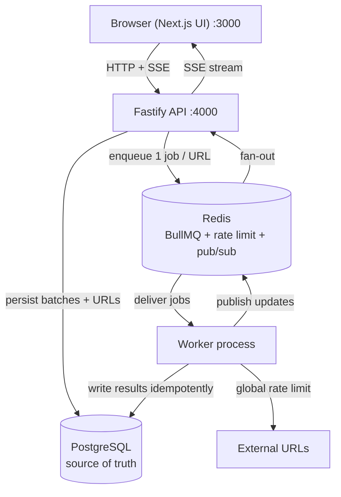

<div align="center">

<picture>
  <source media="(prefers-color-scheme: dark)" srcset="./public/brand/logo/horizontal/urlpulse-dark.png">
  <source media="(prefers-color-scheme: light)" srcset="./public/brand/logo/horizontal/urlpulse-light.png">
  
</picture>

# URLPulse

**Bulk URL health monitoring with reliable background processing and real-time progress.**

</div>

---

## Overview

URLPulse lets you submit a collection of URLs - pasted directly or uploaded as CSV - and checks each one independently in the background while streaming progress and results to the browser in real time.

For every URL, URLPulse records the final **HTTP status code**, **response time**, **page title** (when available), and its **success / failure state**. Each URL is processed as its own background job, so large batches never block the API and individual URLs can succeed, fail, retry, or be cancelled independently.

## Quick Start

**One command** clones-to-running: it loads `.env`, prompts once for anything missing, validates PostgreSQL and Redis, runs migrations, then starts the API, worker, and web app together.

You need **Node.js 20+**, **pnpm**, a reachable **PostgreSQL**, and a reachable **Redis** (local or hosted - no Docker required).

```bash
git clone https://github.com/niranjansah87/URLPulse.git
cd URLPulse
pnpm install
```

Then start everything with the command for your OS:

| Platform | Command |
|----------|---------|
| **Any (recommended)** | `npm run start` |
| Linux / macOS | `./scripts/start.sh` |
| Windows PowerShell | `.\scripts\start.ps1` |

All three delegate to the same cross-platform Node launcher (`scripts/start.mjs`). On first run it prompts (with hidden input for secrets) for any missing required value, saves it to a gitignored `.env`, and never asks again.

```text
URLPulse
────────────────────────────

✓ Environment loaded
✓ PostgreSQL reachable (localhost:5432)
✓ Redis reachable (…:6379)
✓ Ports free (3000, 4000)
✓ Database migrations applied

Starting services…

Frontend → http://localhost:3000
API      → http://localhost:4000
Worker   → BullMQ worker (separate process)

Press Ctrl+C to stop all services.
```

Open **http://localhost:3000**, create an account, paste or upload some URLs, and watch progress stream in live. `Ctrl+C` stops all three processes cleanly.

### What the launcher does

1. Loads `.env`, layering real environment variables on top (the environment wins).
2. Prompts once for missing **required** credentials (`DATABASE_URL`, `REDIS_URL`) with no-echo input, then persists them to `.env`. In a non-interactive shell it prints the required list and exits instead of hanging.
3. Validates **PostgreSQL** reachability and **Redis** reachability + credentials (a real `AUTH`/`PING` round-trip).
4. Checks that ports **3000** and **4000** are free, with a clear message if not.
5. Runs the project's **migrations** (`pnpm --filter @urlpulse/api migrate`).
6. Starts the **API**, **worker**, and **web** as three separate processes and tears them all down (no orphans) on `Ctrl+C`.

> The launcher is orchestration only. It never merges the worker into the API - process separation is a design requirement (see [Architecture](#architecture)).

## Environment Variables

Copy [`.env.example`](./.env.example) to `.env` (or let the launcher create it). **Never commit a real `.env`** - it is gitignored. Only `DATABASE_URL` and `REDIS_URL` have no safe default; everything else defaults for local development.

| Variable | Required | Secret | Default | Purpose |
|----------|:--------:|:------:|---------|---------|
| `DATABASE_URL` | ✅ | ✅ | - | PostgreSQL connection string (source of truth) |
| `REDIS_URL` | ✅ | ✅ | - | Redis connection string (BullMQ, rate limit, pub/sub) |
| `NODE_ENV` | | | `development` | `development` \| `test` \| `production` |
| `API_PORT` | | | `4000` | Fastify API port |
| `NEXT_PUBLIC_API_URL` | | | `http://localhost:4000/api` | Browser-facing API base (web) |
| `API_INTERNAL_URL` | | | `http://127.0.0.1:4000/api` | Loopback API base for Next.js Server Components |
| `WEB_ORIGIN` | | | `http://localhost:3000` | Web origin trusted for credentialed CORS |
| `BETTER_AUTH_URL` | | | `http://localhost:4000` | Public API base where Better Auth is mounted |
| `BETTER_AUTH_SECRET` | prod only | ✅ | dev insecure default | Signs session cookies. **Required in production**; generate with `openssl rand -base64 32` |
| `RESEND_API_KEY` | prod only | ✅ | - (email no-ops) | Resend key for password-reset email. **Required in production**; unset in dev/test makes email a safe no-op |
| `RESEND_FROM_EMAIL` | | | `URLPulse <onboarding@resend.dev>` | Verified sender for reset email |
| `RATE_LIMIT_RPS` | | | `10` | Global outbound request cap |
| `MAX_CONCURRENCY` | | | `5` | Max URL checks in flight |
| `MAX_RETRIES` | | | `3` | Retry attempts for transient failures |
| `BATCH_LIST_CACHE_SECONDS` | | | `30` | Batch-list cache lifetime |
| `HTTP_TIMEOUT_MS` | | | `10000` | Per-check request timeout |
| `HTTP_MAX_REDIRECTS` | | | `5` | Redirect cap per check |
| `HTTP_MAX_BODY_BYTES` | | | `262144` | Response body cap (title parsing) |
| `HTTP_ALLOW_PRIVATE_HOSTS` | | | `false` | SSRF: allow loopback/private targets. **Must be `false` in production** |
| `DB_POOL_MAX` | | | `10` | Per-process PG pool size (shared budget - see below) |
| `CONCURRENCY_LEASE_TTL_MS` | | | `30000` | Distributed concurrency lease TTL |
| `STUCK_PROCESSING_MS` | | | `60000` | Reclaim a `PROCESSING` URL to `PENDING` after this (crash recovery) |
| `RECONCILE_INTERVAL_MS` | | | `30000` | How often the API runs the reconciliation sweep |

Secrets (`DATABASE_URL`, `REDIS_URL`, `BETTER_AUTH_SECRET`, `RESEND_API_KEY`) are **server-only** and never exposed to the browser. Only `NEXT_PUBLIC_*` values reach the client bundle; never put a secret in one.

**PostgreSQL + hosted Redis** is a fully supported development setup: point `DATABASE_URL` at a local Postgres and `REDIS_URL` at any hosted Redis (`redis://` or `rediss://`, with credentials). The launcher's Redis check performs a real authenticated `PING`, so a bad hosted URL fails fast with a clear message.

## Architecture



| Component | Responsibility |
|-----------|----------------|
| **Next.js web** (`apps/web`) | UI for submission, batch list, and live batch detail. A projection of backend state - never authoritative. |
| **Fastify API** (`apps/api`) | Accepts submissions, persists state, enqueues jobs, serves reads, streams SSE, mounts auth. Stateless; horizontally scalable. |
| **Worker** (`apps/worker`) | Separate process. Consumes jobs, performs checks under the global rate limit and concurrency cap, writes results idempotently. |
| **PostgreSQL** | Authoritative application state (batches, URLs, counters, sessions). |
| **Redis** | BullMQ backing store, global rate-limiter coordination, pub/sub fan-out for live updates. |
| **`packages/types`** | Shared domain/API types + zod schemas used by both client and server. |
| **`packages/config`** | Server-only env loading/validation (never imported by the browser bundle). |
| **`packages/outbound`** | Redis-coordinated global rate limiter + SSRF guard used by the worker's outbound checks. |

**Source of truth:** PostgreSQL is authoritative. Redis, BullMQ, browser state, and SSE events are infrastructure and transport - any batch page can be opened directly or refreshed and fully reconstructed from the API. Deep design lives in [`docs/`](./docs/README.md).

## Background Processing

- **One job per URL** - the API enqueues one BullMQ job per URL with `jobId = urlId`, so duplicate enqueues collapse to a single job (idempotent submission).
- **Concurrency = 5** - at most 5 checks are in flight at once, enforced by a Redis-coordinated lease (not a per-process counter).
- **Global rate limit = 10 req/s** - enforced **across the whole system** via shared Redis state, so it holds regardless of worker count. It is never `10 × workerCount`. See [`docs/03-backend/rate-limiting.md`](./docs/03-backend/rate-limiting.md).
- **Retries** - up to **3 retries** for *transient* failures (timeouts, 5xx, connection errors) with **exponential backoff** - i.e. **4 total attempts** (1 initial + 3 retries; BullMQ `attempts = MAX_RETRIES + 1`). Permanent failures (invalid URL, 4xx, SSRF-blocked host, unresolvable DNS) are not retried.
- **Multiple workers** - concurrency and rate limiting are both Redis-coordinated, so running N workers scales throughput without exceeding either global limit.

Concurrency and rate limiting are **separate constraints**: a worker acquires both a concurrency slot and a rate-limit permit before making an outbound request.

## Idempotency

BullMQ delivers **at-least-once**, so jobs must be safe to run more than once.

- Enqueue is idempotent (`jobId = urlId`).
- Result persistence uses **conditional state transitions** - a URL is written only from a non-terminal state, so replaying a completed job does not double-count progress or flip a success to a failure.
- Batch counters are derived from URL rows, not incremented blindly.
- **Crash between HTTP call and persistence:** the URL stays `PROCESSING`; the reconciliation sweep reclaims it to `PENDING` after `STUCK_PROCESSING_MS`, and it is retried. The worst case is a repeated HTTP request, never a corrupted count.

This is **at-least-once processing with idempotent state transitions**, not exactly-once. See [`docs/03-backend/retries-and-idempotency.md`](./docs/03-backend/retries-and-idempotency.md).

## Live Updates

Progress is delivered over **Server-Sent Events**, chosen because updates are one-directional (server → client) and SSE reconnects natively. On connect or reconnect the client **refetches the authoritative snapshot** from the API, so the transport is never the source of truth. Multiple API instances fan out through **Redis pub/sub**, so a client connected to any instance sees updates from any worker. A dropped connection recovers automatically: reconnect → refetch snapshot → resume stream. See [`docs/04-frontend/live-updates.md`](./docs/04-frontend/live-updates.md).

## Cancellation

Cancelling a batch transitions it conditionally (only from `PENDING`/`PROCESSING`) and flips its non-terminal URLs to a cancelled state in the same operation. Queued jobs are removed; an in-flight worker checks the persisted state and **never overwrites an accepted cancellation** (a stale worker result loses the race). Persisted state stays consistent with what the UI shows. See [`docs/03-backend/cancellation.md`](./docs/03-backend/cancellation.md).

## Retry Failed

Retrying a batch atomically claims **only** its `FAILED` URLs back to `PENDING` (resetting attempt counts) and re-enqueues them. Successful URLs are never touched or re-run. The claim is conditional (`WHERE status = 'FAILED'`), so a second concurrent retry finds no rows - idempotent.

## Caching

The batch-list endpoint is cached in Redis for **30 seconds** (`BATCH_LIST_CACHE_SECONDS`). Invalidation is version-based: a shared Redis counter (`BATCH_LIST_CACHE_VERSION_KEY`) is part of every cache key, and bumping it (`INCR`) orphans all cached pages at once - immediate, and shared across all API instances. **Every batch-level state change invalidates the cache immediately:** creation, cancellation, and retry-failed (from the API), and the worker-driven transitions PENDING → PROCESSING (first URL claimed) and → COMPLETED/FAILED (last URL done) - the worker bumps the same key. What is deliberately *not* invalidated is per-URL progress within a batch (that would defeat the cache); the 30-second TTL bounds any such intermediate staleness, and the batch **detail** page is uncached and always live via SSE.

## Next.js Decisions

Deliberate choices (see [`docs/04-frontend/frontend-architecture.md`](./docs/04-frontend/frontend-architecture.md)):

- **Server Components** fetch the authoritative batch snapshot server-side via `API_INTERNAL_URL`, so a directly-opened or refreshed batch URL renders correct state with no client round-trip.
- **Client Components** own only the live layer - the SSE subscription and optimistic UI - and always reconcile against the server snapshot.
- **Routing** gives every batch its own URL (`/batches/[id]`) that works cold in a new tab.
- **Refresh-safe:** UI state is a projection; nothing important lives only in React state.

## Horizontal Scaling

Running multiple API instances behind a load balancer is correct by design:

- **PostgreSQL** is the single shared source of truth; API instances are stateless.
- **Redis/BullMQ** is a shared queue and coordination layer - the global rate limit and concurrency cap are Redis-backed, so they hold across all API instances and all workers.
- **Auth sessions** are PostgreSQL-backed, so any instance can serve any authenticated request.
- **Live updates** fan out through Redis pub/sub, so a client on instance A sees events produced anywhere.
- **Cache** invalidation is shared through Redis.
- **Workers** scale independently of the API; more workers means more throughput without breaching the global limits.

See [`docs/05-infrastructure/scaling.md`](./docs/05-infrastructure/scaling.md).

## Local Development

The one-command launcher is the recommended path, but each process can be run on its own:

```bash
pnpm dev:api          # Fastify API only
pnpm dev:worker       # BullMQ worker only
pnpm dev:web          # Next.js only
pnpm dev              # all three in parallel (no pre-flight checks/migrations)
```

PostgreSQL and Redis are external to this repo - point `DATABASE_URL` and
`REDIS_URL` at your own instances (local install or hosted), then apply
migrations:

```bash
pnpm db:migrate
```

## Testing

```bash
pnpm test             # Vitest across all packages (loads .env automatically)
pnpm typecheck        # tsc --noEmit across all packages
pnpm lint             # ESLint
pnpm build            # next build (web) + tsc (api/worker/packages)
```

`pnpm test` runs through `scripts/with-env.mjs`, which loads `.env` first, so the suite works from a clean shell without exporting variables by hand. Integration tests (rate limiter, concurrency, repositories, auth) require a reachable PostgreSQL and Redis; pure unit tests do not. Testing focuses on the guarantees most likely to break under load and concurrency:

- Global rate limit (including across **multiple** workers)
- Concurrency cap (5 in flight)
- Retry and exponential backoff
- Idempotent job execution (duplicate delivery)
- Cancellation of queued and in-flight jobs
- Retry-failed (only failed URLs re-run)
- Batch-list cache behavior and invalidation

See [`docs/06-quality/testing.md`](./docs/06-quality/testing.md) and [`docs/06-quality/edge-cases.md`](./docs/06-quality/edge-cases.md).

## Security

URLPulse makes outbound HTTP requests to user-supplied URLs, so **SSRF is a primary consideration**: hosts are validated and loopback/private/link-local/metadata targets are blocked unless `HTTP_ALLOW_PRIVATE_HOSTS=true` (local dev only). Every outbound check is time-bounded, redirect-bounded, and body-bounded so one URL cannot hang a worker or exhaust memory. Batches are owned by the authenticated user; ownership is derived from the session (never the client) and cross-user access returns `404`. See [`SECURITY.md`](./SECURITY.md) and [`docs/03-backend/authentication.md`](./docs/03-backend/authentication.md).

## Trade-offs - with more time

- **Broader end-to-end tests** - a full browser E2E covering submit → live progress → cancel → retry, plus a multi-worker rate-limit soak test in CI.
- **Observability** - structured metrics and tracing (OpenTelemetry) around the rate limiter and queue depth, rather than the current log lines.
- **Cache invalidation granularity** - per-user targeted invalidation instead of clearing the batch-list cache wholesale.
- **Worker shutdown** - drain in-flight checks on `SIGTERM` before exit rather than relying solely on lease/reconciliation recovery.
- **Deploy pipeline** - production container images and Nginx config now ship (see Deployment below); a CI build/push pipeline remains future work.

## Assumptions

Where the brief was ambiguous:

- **Authentication is in scope** because batches are per-user; minimal email/password auth via Better Auth with PostgreSQL-backed sessions. Ownership is enforced at the data boundary.
- **Redis may be hosted/remote**; the launcher and app support `redis://` and `rediss://` with credentials.
- **PostgreSQL and Redis are external** in every environment - point `DATABASE_URL` / `REDIS_URL` at your own instances (local install or hosted). There is no bundled database/cache. Production uses `docker-compose.prod.yml` (web + api + worker; PostgreSQL, Redis, and Nginx external) - see Deployment.
- **"Transient" failures** eligible for retry are timeouts, connection errors, and 5xx responses; 4xx and invalid/blocked URLs are permanent.
- **CSV parsing** extracts URLs leniently: blank rows are skipped, malformed rows are reported, and duplicates within a batch collapse by `jobId`.


## Deployment

Production runs three containers - **web, api, worker** (+ a one-shot migrate) -
with **PostgreSQL, Redis, and Nginx hosted externally** (never in the compose
file). A **host-installed Nginx** terminates TLS for `urlpulse.niranjansah87.com.np`
and serves the frontend and API from one origin (`/api/*` -> Fastify, everything
else -> Next.js), proxying to the containers' loopback ports (3000 / 4000).
`scripts/deploy.sh` runs the whole flow with a preflight checklist. Full guide -
environment variables, migration procedure, TLS/certbot, host-Nginx config, SSE
proxying, and horizontal-scaling notes:
[`docs/05-infrastructure/deployment.md`](./docs/05-infrastructure/deployment.md).

```bash
cp .env.production.example .env.production   # fill in real values
./scripts/deploy.sh                          # preflight → nginx → build → up → health-check
```

## Documentation

Full documentation index: [`docs/README.md`](./docs/README.md).

## Project Structure

```text
URLPulse/
├── apps/
│   ├── web/              # Next.js App Router UI (@urlpulse/web)
│   ├── api/              # Fastify API + SQL migrations (@urlpulse/api)
│   └── worker/           # BullMQ worker (@urlpulse/worker)
├── packages/
│   ├── types/            # Shared domain/API types + zod schemas (@urlpulse/types)
│   ├── config/           # Server env loading/validation (@urlpulse/config)
│   └── outbound/         # Global rate limiter + SSRF guard (@urlpulse/outbound)
├── scripts/
│   ├── start.mjs         # Cross-platform one-command launcher
│   ├── start.sh          # Linux/macOS wrapper
│   ├── start.ps1         # Windows PowerShell wrapper
│   ├── deploy.sh         # One-shot production deploy (preflight → nginx → docker → health)
│   └── with-env.mjs      # Loads .env, then runs a command (used by `pnpm test`)
├── docker/               # Production Dockerfiles (server = api/worker/migrate; web)
├── nginx/                # Reference host-Nginx config (TLS, /api proxy, SSE)
├── docs/                 # Product, architecture, backend, frontend, infra, quality
├── public/               # Canonical brand assets
├── docker-compose.prod.yml  # Production: web + api + worker (external PG/Redis/Nginx)
├── .env.example
└── .env.production.example
```

## License

[MIT](./LICENSE)

## Author

**Niranjan Sah** - [niranjansah87.com.np](https://niranjansah87.com.np/) · [github.com/niranjansah87](https://github.com/niranjansah87)
