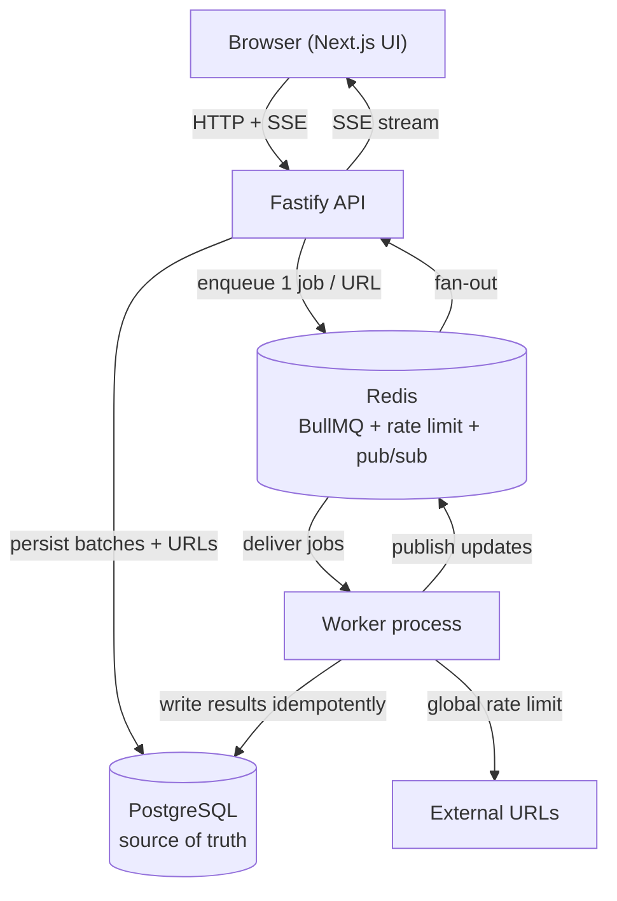

<div align="center">

<picture>
  <source media="(prefers-color-scheme: dark)" srcset="./public/brand/logo/horizontal/urlpulse-light.png">
  <source media="(prefers-color-scheme: light)" srcset="./public/brand/logo/horizontal/urlpulse-dark.png">
  
</picture>

# URLPulse

**Bulk URL health monitoring with reliable background processing and real-time progress.**

</div>

---

## Overview

URLPulse lets you submit a collection of URLs — pasted directly or uploaded as CSV — and checks each one independently in the background while streaming progress and results to the browser in real time.

For every URL, URLPulse records:

- Final HTTP status code
- Response time
- Page title, when available
- Success / failure state and processing status

Each URL is processed as its own background job, so large batches never block the API and individual URLs can succeed, fail, retry, or be cancelled independently.

> **Project status:** This repository currently contains the product and engineering documentation and the brand assets. The application (Next.js web, Fastify API, and BullMQ worker) is being implemented against the design in [`docs/`](./docs/README.md). Features below are marked **implemented** or **planned** accordingly.

## Key Features

| Feature | Status |
|---------|--------|
| Bulk URL submission (paste) | Planned |
| CSV upload | Planned |
| Background processing with BullMQ | Planned |
| PostgreSQL-backed durable state | Planned |
| Redis-backed distributed coordination | Planned |
| Global 10 requests/second outbound HTTP limit | Planned |
| Maximum 5 URL checks in flight | Planned |
| Retry with exponential backoff | Planned |
| Idempotent job processing | Planned |
| Batch cancellation (queued + in-flight) | Planned |
| Retry failed URLs only | Planned |
| Real-time progress via Server-Sent Events | Planned |
| Refresh-safe state reconstruction | Planned |
| 30-second batch-list caching with invalidation | Planned |
| Light and dark UI themes | Planned |

The engineering design for every item above is documented in [`docs/`](./docs/README.md).

## Architecture



| Component | Responsibility |
|-----------|----------------|
| **Next.js web** | UI for submission, batch list, and live batch detail. A projection of backend state — never authoritative. |
| **Fastify API** | Accepts submissions, persists state, enqueues jobs, serves reads, streams SSE. Stateless; horizontally scalable. |
| **Worker** | Separate process. Consumes jobs, performs checks under the global rate limit, writes results idempotently. |
| **PostgreSQL** | Authoritative application state (batches, URLs, counters). |
| **Redis** | BullMQ backing store, global rate-limiter coordination, pub/sub fan-out for live updates. |

## Core Guarantees

### Global rate limit

URLPulse enforces a maximum of **10 outbound HTTP requests per second across the entire system**. The limiter is Redis-coordinated so the limit holds regardless of how many worker processes are running — it is never `10 × workerCount`. See [`docs/03-backend/rate-limiting.md`](./docs/03-backend/rate-limiting.md).

### Concurrency

At most **5 URL checks are in flight at once**. Concurrency and the request-rate limit are **separate constraints** — a worker acquires both a concurrency slot and a rate-limit permit before starting an outbound request.

### Source of truth

**PostgreSQL is authoritative.** Redis, BullMQ, browser state, and live events are infrastructure and transport — they must not replace durable state. Any batch page can be opened directly or refreshed and fully reconstructed from the API.

### Idempotency

Jobs are designed for at-least-once delivery. Repeated execution of the same job must not double-count progress or corrupt state; state transitions are applied conditionally in the database. See [`docs/03-backend/retries-and-idempotency.md`](./docs/03-backend/retries-and-idempotency.md).

### Live updates

Live progress is delivered over **Server-Sent Events**, chosen because updates are one-directional (server → client) and SSE reconnects natively. Multiple API instances fan out through Redis pub/sub. On connect or reconnect the client refetches the authoritative snapshot from the API, so the transport is never the source of truth. See [`docs/04-frontend/live-updates.md`](./docs/04-frontend/live-updates.md).

## Tech Stack

- **Next.js** + **React** + **TypeScript** — web UI
- **Fastify** + **TypeScript** — API
- **PostgreSQL** — durable application state
- **Redis** — coordination, rate limiting, pub/sub
- **BullMQ** — background job processing
- **Docker** / **Docker Compose** — local infrastructure

## Project Structure

Current repository (design + assets):

```text
urlpulse/
├── docs/                 # Product, architecture, backend, frontend, infra, quality
├── public/               # Brand assets
│   ├── brand/            #   logo/ (horizontal, vertical) + mark/
│   ├── icons/            #   favicons, apple-touch, PWA icons
│   ├── og/               #   Open Graph images
│   └── site.webmanifest
├── CLAUDE.md             # Engineering guardrails for contributors and coding agents
├── LICENSE
└── README.md
```

Planned application layout (not yet scaffolded):

```text
urlpulse/
├── apps/
│   ├── web/              # Next.js application
│   └── api/              # Fastify API
├── worker/               # BullMQ worker process
├── packages/
│   └── shared/           # Shared TypeScript types
└── docker-compose.yml
```

## Getting Started

> The application is not yet scaffolded, so runnable commands do not exist yet. This section documents the **intended** local workflow; it will be finalized once `apps/`, `worker/`, and `docker-compose.yml` land.

### Prerequisites

- Node.js (LTS)
- [pnpm](https://pnpm.io/)
- Docker + Docker Compose

### Clone

```bash
git clone https://github.com/niranjansah87/Urlpulse.git
cd Urlpulse
```

### Configure environment

```bash
cp .env.example .env
# edit .env as needed
```

### Start (target workflow)

```bash
docker compose up --build
```

Once running, the intended local URLs are:

- Web UI: `http://localhost:3000`
- API: `http://localhost:4000`
- PostgreSQL: `localhost:5432`
- Redis: `localhost:6379`

## Environment Variables

See [`.env.example`](./.env.example) for the full list. Never commit a real `.env`.

| Variable | Description |
|----------|-------------|
| `DATABASE_URL` | PostgreSQL connection string |
| `REDIS_URL` | Redis connection string |
| `API_PORT` | Fastify API port (default `4000`) |
| `WEB_PORT` | Next.js port (default `3000`) |
| `RATE_LIMIT_RPS` | Global outbound request cap (default `10`) |
| `MAX_CONCURRENCY` | Max URL checks in flight (default `5`) |
| `MAX_RETRIES` | Retry attempts for transient failures (default `3`) |

## Development

> Package scripts do not exist until the workspace is scaffolded. The intended commands are:

```bash
# install dependencies
pnpm install

# run the full stack in development
pnpm dev

# run individual processes
pnpm dev:api
pnpm dev:worker
pnpm dev:web

# quality gates
pnpm lint
pnpm typecheck
pnpm test
pnpm build
```

This README must be updated to remove the "intended" caveats once these scripts exist.

## Testing

Testing focuses on the system guarantees most likely to break under load and concurrency:

- Global rate limit (including across **multiple** workers)
- Concurrency cap (5 in flight)
- Retry and exponential backoff
- Idempotent job execution (duplicate delivery)
- Cancellation of queued and in-flight jobs
- Retry-failed (only failed URLs re-run)
- Live-update recovery after dropped SSE connections
- Batch-list cache behavior and invalidation

See [`docs/06-quality/testing.md`](./docs/06-quality/testing.md) and [`docs/06-quality/edge-cases.md`](./docs/06-quality/edge-cases.md).

## Documentation

Full documentation index: [`docs/README.md`](./docs/README.md).

## Security

See [`SECURITY.md`](./SECURITY.md). URLPulse makes outbound HTTP requests to user-supplied URLs, so **SSRF is a primary consideration** — the security policy separates current controls from recommended production hardening.

## Contributing

See [`CONTRIBUTING.md`](./CONTRIBUTING.md). Changes affecting the database, queues, workers, rate limiting, concurrency, live updates, or API contracts must update the relevant documentation.

## License

[MIT](./LICENSE)

## Author

**Niranjan Sah** — [niranjansah87.com.np](https://niranjansah87.com.np/) · [github.com/niranjansah87](https://github.com/niranjansah87)
