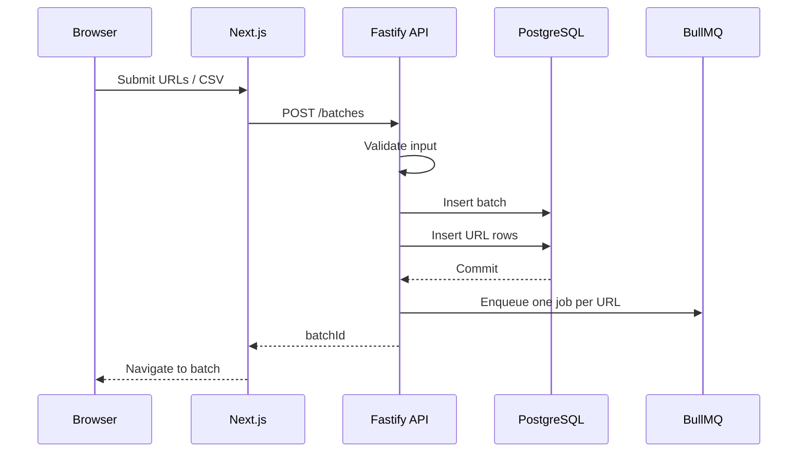
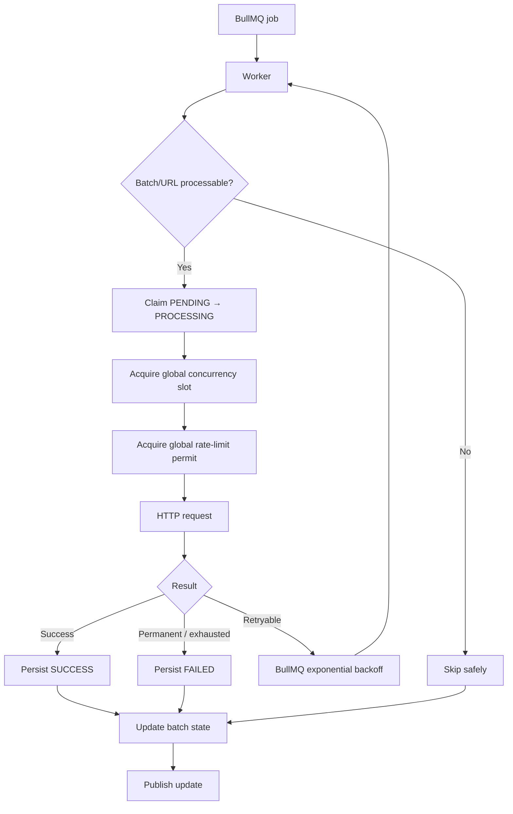
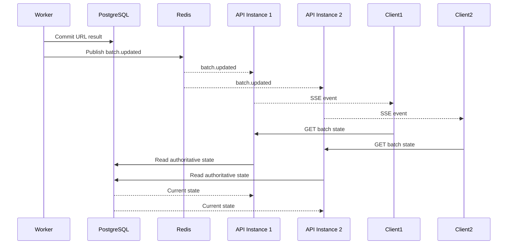
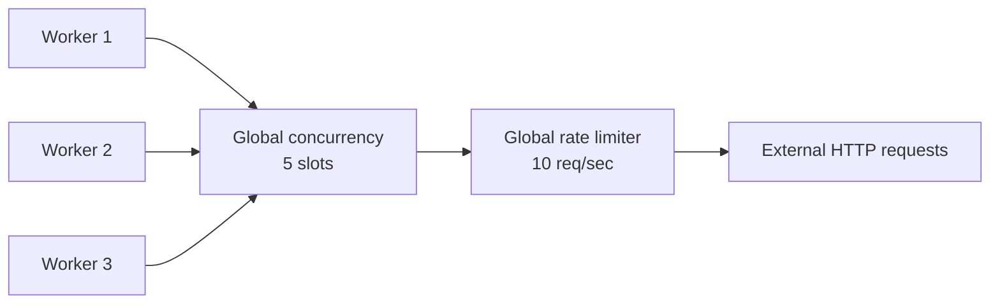
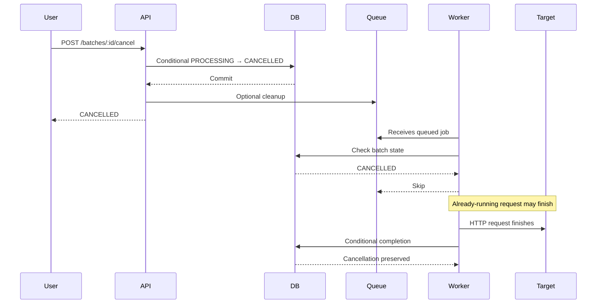
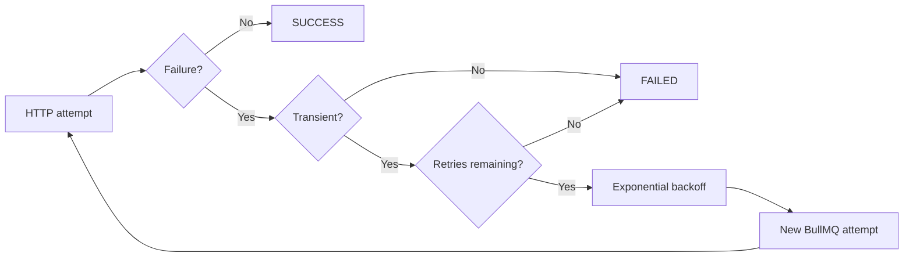
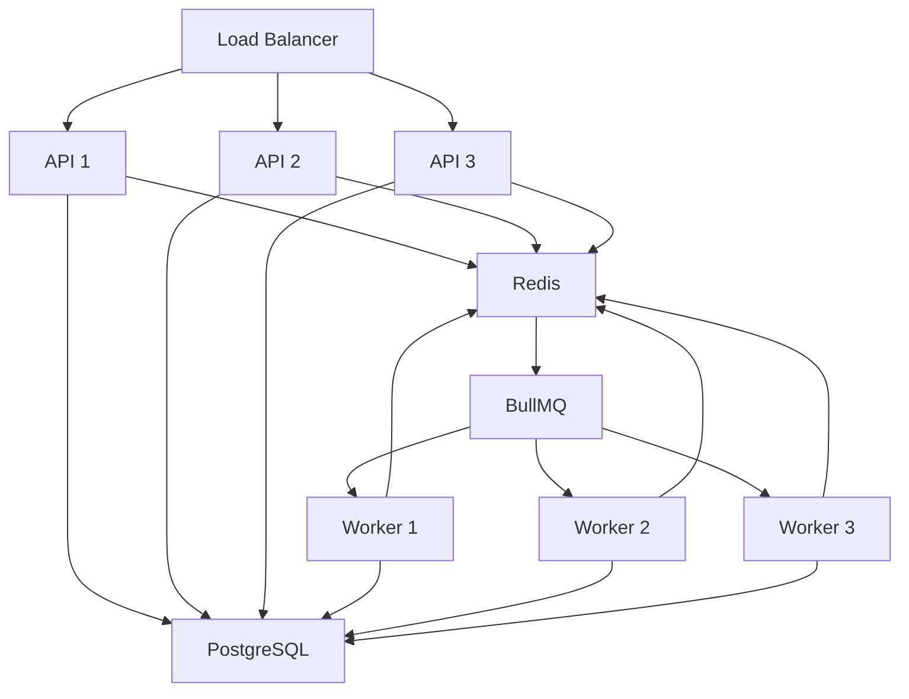
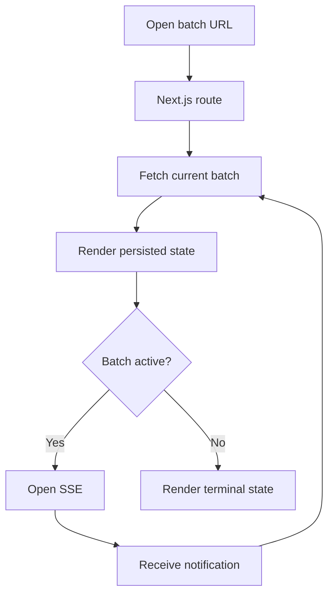
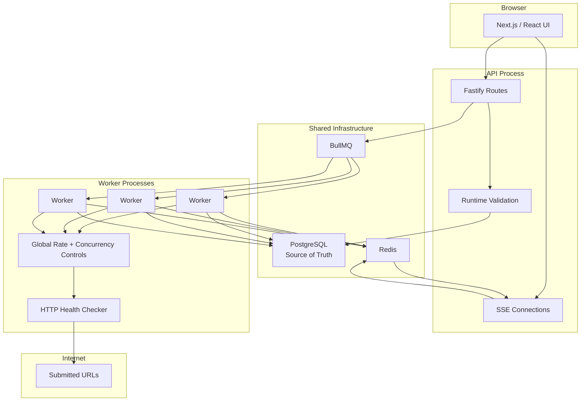

# URLPulse - Architecture Diagram

**Version:** 1.0  
**Status:** Draft

---

# 1. System Overview

URLPulse consists of five logical layers:

```text
┌──────────────────────────────────────────────┐
│                  Browser                     │
│              Next.js + React                 │
└──────────────────────┬───────────────────────┘
                       │ HTTP / SSE
                       ▼
┌──────────────────────────────────────────────┐
│                    API                       │
│          Fastify + TypeScript                │
└───────────────┬────────────────┬─────────────┘
                │                │
                ▼                ▼
        ┌──────────────┐   ┌──────────────┐
        │ PostgreSQL   │   │    Redis     │
        │ Source of    │   │ Queue +      │
        │ Truth        │   │ Coordination │
        └──────┬───────┘   └──────┬───────┘
               │                  │
               │                  ▼
               │          ┌──────────────┐
               │          │   BullMQ     │
               │          └──────┬───────┘
               │                 │
               │                 ▼
               │          ┌──────────────┐
               └─────────►│   Workers    │
                          │ Separate proc│
                          └──────┬───────┘
                                 │
                                 ▼
                          External URLs
```

The required stack is Node.js/TypeScript, Fastify, PostgreSQL, Redis, BullMQ, and Next.js/TypeScript. 

---

# 2. Request Flow - Batch Creation



The database must contain the batch and URL records before checking begins, and each URL is an independent background job. 

---

# 3. Worker Processing Flow



The worker must preserve the required 10 requests/sec global rate limit, 5 in-flight concurrency limit, and up to 3 retries on transient failures. 

---

# 4. Live Update Flow



This allows live updates to remain correct when more than one API instance serves clients. 

---

# 5. Distributed Limits



Both controls are global.

Incorrect:

```text
Worker 1 → 5 concurrency
Worker 2 → 5 concurrency
```

Correct:

```text
All workers → shared 5-slot limit
```

Likewise, the rate limit is:

```text
All workers → shared 10 req/sec limit
```

not 10 req/sec per worker. 

---

# 6. Cancellation Flow



Queue cleanup is not the correctness mechanism.

The worker must verify authoritative database state.

---

# 7. Retry Flow



Maximum:

```text
1 initial attempt
+
3 retries
=
4 outbound attempts
```

Every attempt passes through the global rate limiter.

---

# 8. Source-of-Truth Boundaries

```text
PostgreSQL
──────────
Authoritative:
- Batch status
- URL status
- Results
- Counters
- Attempts
- Cancellation
- Retry eligibility

BullMQ / Redis
──────────────
Represents:
- Pending work
- Retry scheduling
- Delayed jobs
- Queue delivery

SSE / Browser
─────────────
Represents:
- Notifications
- Current UI projection
```

A queue message is not proof that a URL is still eligible for processing.

---

# 9. Horizontal Scaling



Adding API instances must not change application semantics.

Adding workers must not change:

```text
10 req/sec
5 concurrent checks
retry limits
idempotency
```

---

# 10. Cold Batch Page

Opening:

```text
/batches/:batchId
```

in a new tab follows:



This ensures a new tab does not depend on previous client state. 

---

# 11. Complete Architecture



---

# 12. Architecture Principles

1. PostgreSQL is the source of truth.
2. BullMQ represents asynchronous work.
3. Redis provides shared coordination.
4. API and workers are separate processes.
5. URL checks never run inside HTTP request handlers.
6. Global limits are enforced across workers.
7. State transitions are idempotent.
8. SSE is a freshness mechanism, not the source of truth.
9. Refresh and reconnect always recover from PostgreSQL.
10. Horizontal scaling must not change correctness guarantees.

---

# 13. Requirement Traceability

| System Requirement | Architecture Mechanism |
|---|---|
| URL/CSV submission | Next.js + Fastify |
| Persist before checking | PostgreSQL transaction |
| One job per URL | BullMQ |
| Separate workers | Worker process |
| 10 req/sec globally | Redis-backed limiter |
| 5 checks in flight | Distributed concurrency control |
| 3 retries | BullMQ retry/backoff |
| Live updates | SSE + Redis |
| Refresh safe | PostgreSQL state fetch |
| Multiple API instances | Stateless API + Redis |
| Cancel | DB state transition + worker checks |
| Retry failed only | Conditional failed-row claiming |
| 30 sec cache | Shared batch-list cache |
| Shared types | TypeScript shared package |
| Direct batch URL | Next.js dynamic route |

The architecture is intentionally centered on the core requirements: global rate/concurrency behavior, infrastructure justification, source of truth, idempotency, type safety, Next.js fundamentals, process separation, and live-update resilience. 
