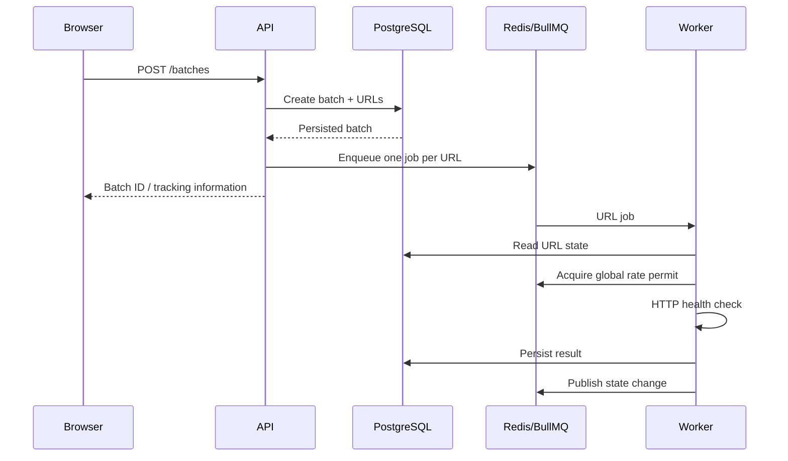

# URLPulse - Architecture

This document explains why each infrastructure component exists, where state lives, how idempotency is guaranteed, how the API, worker, and UI are separated, and how live updates stay resilient.

The recommended architecture is:

```text
                    ┌──────────────────┐
                    │     Browser      │
                    │   Next.js UI     │
                    └────────┬─────────┘
                             │
                     HTTP / SSE
                             │
                             ▼
                ┌────────────────────────┐
                │     Fastify API        │
                │                        │
                │ Batch API              │
                │ Query API              │
                │ Control API            │
                │ SSE connections        │
                └───────┬────────┬───────┘
                        │        │
                  SQL   │        │ Redis
                        │        │
                        ▼        ▼
                ┌───────────┐  ┌───────────┐
                │ PostgreSQL│  │   Redis    │
                │           │  │            │
                │ Source of │  │ BullMQ     │
                │ truth     │  │ Pub/Sub    │
                └───────────┘  │ Rate limit │
                               └─────┬─────┘
                                     │
                                  BullMQ
                                     │
                                     ▼
                              ┌─────────────┐
                              │   Worker    │
                              │             │
                              │ concurrency │
                              │ URL checker │
                              │ rate limit  │
                              └──────┬──────┘
                                     │
                                     ▼
                               External URLs
```

Here is the document.

````md
# URLPulse - System Architecture

**Version:** 1.0  
**Status:** Draft  
**Architecture Style:** Modular distributed application

---

# 1. Architecture Overview

URLPulse is composed of four primary application components:

1. Next.js frontend
2. Fastify API
3. BullMQ worker
4. Shared infrastructure

The system uses:

- PostgreSQL for authoritative application state
- Redis for queue infrastructure and distributed coordination
- BullMQ for background URL-processing jobs
- SSE for server-to-client live progress updates

The architecture deliberately separates the API process from the worker process.

---

# 2. High-Level Architecture

```mermaid
flowchart TD
    Browser["Browser / Next.js UI"]

    API["Fastify API"]

    DB[("PostgreSQL\nSource of Truth")]

    Redis[("Redis")]

    Queue["BullMQ Queue"]

    Worker["URL Worker"]

    URLs["External URLs"]

    Browser -->|HTTP| API
    Browser -->|SSE| API

    API -->|SQL| DB
    API -->|Enqueue jobs| Queue

    Queue --> Redis
    Worker -->|Consume jobs| Queue

    Worker -->|Read / update state| DB
    Worker -->|Distributed rate limit| Redis
    Worker -->|Publish state changes| Redis

    Redis -->|Events| API

    Worker -->|HTTP checks| URLs
````

---

# 3. Component Responsibilities

## 3.1 Next.js Frontend

The frontend is responsible for:

* Rendering the batch list
* Rendering batch detail pages
* Accepting URL input
* Accepting CSV uploads
* Displaying progress
* Displaying URL results
* Connecting to the live-update stream
* Triggering cancellation
* Triggering retry-failed

The frontend does not own authoritative batch state.

Client-side state is treated as a representation of server state.

---

# 4. Fastify API

The Fastify API is responsible for synchronous application operations.

Responsibilities:

* Request validation
* Batch creation
* Batch queries
* Batch cancellation
* Retry-failed requests
* Job enqueueing
* SSE connections
* Cache handling
* Authentication-independent request handling

The API does not perform URL health checks.

This keeps long-running external network operations out of the request/response lifecycle.

---

# 5. Worker Process

Workers run separately from the API.

Responsibilities:

1. Consume BullMQ jobs.
2. Check URL state.
3. Respect cancellation.
4. Acquire a global request-rate permit.
5. Perform the HTTP request.
6. Extract result data.
7. Persist the result.
8. Update URL/batch state safely.
9. Publish a state-change notification.
10. Allow BullMQ to retry eligible failures.

Workers can run as multiple processes.

The architecture must remain correct when multiple workers consume the same queue.

---

# 6. PostgreSQL

PostgreSQL is the authoritative source of application state.

It stores:

* Batches
* URLs
* Processing state
* URL results
* Failure information
* Timestamps
* Progress-related data

The queue does not replace database state.

If Redis or BullMQ state conflicts with PostgreSQL application state, PostgreSQL is authoritative.

---

# 7. Redis

Redis has several infrastructure responsibilities.

## 7.1 BullMQ Infrastructure

BullMQ uses Redis to coordinate background jobs.

---

## 7.2 Global Rate Limiting

Redis provides shared coordination for the global HTTP request rate limit.

This prevents each worker from independently applying its own limit.

---

## 7.3 Live Event Distribution

Workers publish state-change notifications through Redis.

API instances subscribe to those events and forward them to connected SSE clients.

This allows multiple API instances to participate in live updates without relying on process-local event state.

---

# 8. BullMQ

BullMQ represents asynchronous URL-processing work.

Each URL receives an independent job.

Conceptually:

```text
Batch
 ├── URL A → Job A
 ├── URL B → Job B
 ├── URL C → Job C
 └── URL D → Job D
```

This allows URLs to complete independently.

One failed URL does not inherently block other URLs in the batch.

---

# 9. Request Lifecycle

## 9.1 Batch Creation



The important ordering is:

```text
Persist batch + URLs
        ↓
Enqueue jobs
        ↓
Worker processing
```

The system must not begin URL processing before the batch and URLs have been persisted.

---

# 10. Source of Truth Model

The system deliberately separates:

### Durable State

PostgreSQL

### Job Orchestration

BullMQ + Redis

### Live Notifications

Redis event distribution + SSE

### UI Representation

React/Next.js client state

The relationship is:

```text
             PostgreSQL
           authoritative
                 │
        ┌────────┴────────┐
        │                 │
     API queries       Worker updates
        │                 │
        ▼                 ▼
      Browser        Redis events
                          │
                          ▼
                         SSE
                          │
                          ▼
                       Browser
```

The live event stream tells the browser that state changed.

It does not become the state itself.

---

# 11. Live Update Architecture

SSE is selected as the live-update transport.

Reasons:

* Communication is primarily server → client.
* The browser does not need a bidirectional socket for this use case.
* SSE has a simple browser API.
* Automatic reconnection is built into the browser model.
* The application can keep the API contract simple.
* The transport is sufficient for batch progress notifications.

WebSockets would provide more capability than this use case requires.

---

# 12. Multi-Instance SSE

A single API process cannot own the global event state because API instances may scale horizontally.

Instead:

```text
Worker
   │
   │ publish
   ▼
Redis
   │
   ├───────────────┐
   ▼               ▼
API Instance A   API Instance B
   │               │
   ▼               ▼
SSE Client A     SSE Client B
```

Each API instance subscribes to relevant Redis events and forwards matching events to its locally connected clients.

No client depends on a particular API instance remaining alive.

---

# 13. SSE Recovery

The live event stream is not the source of truth.

When an SSE connection is established:

1. The API establishes its Redis subscription.
2. The API reads the current batch state from PostgreSQL.
3. The API sends the current state/snapshot to the client.
4. Future state changes are streamed through SSE.

This ordering reduces race conditions around missed events.

If an event is missed for any reason, the client can reconstruct correct state from PostgreSQL.

---

# 14. Refresh Behavior

The batch detail page must be independently addressable.

Example:

```text
/batches/01HXYZ...
```

On a cold page load:

```text
Browser
   ↓
Next.js
   ↓
API
   ↓
PostgreSQL
   ↓
Current batch state
```

The page does not require:

* Previous navigation
* Existing React state
* Previously received SSE events

This satisfies the cold-navigation requirement.

---

# 15. Global Rate Limiting

The global limit is:

```text
10 HTTP requests / second
```

The rate limiter must be shared by all workers.

The preferred implementation is a Redis-backed distributed sliding-window limiter.

Conceptually:

```text
Worker A ─┐
Worker B ─┼──> Redis atomic rate limiter
Worker C ─┘
                  │
                  ▼
             HTTP request
```

A request may proceed only after acquiring a permit.

The limiter operates at the point immediately before the outbound HTTP request.

This is intentional: the requirement is about HTTP requests, not merely BullMQ job starts.

The detailed algorithm will be documented in:

`docs/03-backend/rate-limiting.md`

---

# 16. Concurrency

Concurrency is enforced separately from rate limiting.

The worker has a maximum of:

```text
5 URL checks in flight
```

For example:

```text
Worker
 ├── Check 1
 ├── Check 2
 ├── Check 3
 ├── Check 4
 └── Check 5
```

A sixth check must wait.

Multiple workers may exist. The concurrency limit is **global**, not per-worker (ADR-007, ADR-021):
5 in flight across the entire system regardless of worker count. It is enforced with a Redis-backed
distributed limiter whose slots are TTL-leased so a crashed worker cannot leak capacity (ADR-022).

---

# 17. Retry Architecture

BullMQ manages retry scheduling.

A failed transient attempt follows:

```text
Attempt
   │
   ├── Success ──> Persist success
   │
   └── Transient failure
             │
             ▼
       Exponential backoff
             │
             ▼
          Retry job
```

Maximum:

```text
3 retries
```

The exact backoff values and transient-failure classification will be defined in:

`docs/03-backend/retries-and-idempotency.md`

---

# 18. Idempotent Processing

BullMQ provides at-least-once-style job execution semantics rather than an absolute guarantee that a job can never execute twice.

Therefore the worker must be safe against duplicate execution.

Before writing a result, the worker checks persisted state.

Database updates are designed so that a duplicate completion does not:

* Increment progress twice
* Revert cancellation
* Reprocess successful work incorrectly
* Corrupt batch state

The detailed strategy will be documented in:

`docs/03-backend/retries-and-idempotency.md`

---

# 19. Cancellation Architecture

Cancellation is represented in PostgreSQL.

The basic flow is:

```text
User
 ↓
Cancel API
 ↓
PostgreSQL
 ↓
Batch = CANCELLED
```

Queued jobs are prevented from performing work after observing the cancellation state.

In-flight workers cannot always stop an already-started network operation instantaneously.

Therefore the worker must protect the final database transition.

Example race:

```text
Worker                         User

HTTP request starts
                               Cancel batch
                               ↓
                               PostgreSQL = CANCELLED
HTTP request completes
       ↓
Worker attempts success update
       ↓
Conditional state update
       ↓
Cancelled state preserved
```

The exact state-transition rules will be documented in:

`docs/03-backend/cancellation.md`

---

# 20. Retry Failed Architecture

Retry-failed operates against PostgreSQL state.

Conceptually:

```text
Batch
 │
 ├── URL A → SUCCESS
 ├── URL B → FAILED
 ├── URL C → SUCCESS
 └── URL D → FAILED
```

Retry operation:

```text
URL B → new job
URL D → new job
```

It does not create new work for A or C.

This makes the database state the authoritative selection mechanism.

---

# 21. Caching Architecture

The batch-list endpoint is cached for 30 seconds as a system requirement.

The cache is treated as a performance layer only.

Important state mutations invalidate the affected cache.

For example:

```text
POST /batches
      ↓
Persist batch
      ↓
Invalidate batch-list cache
```

And when a batch changes state:

```text
Worker
  ↓
PostgreSQL update
  ↓
Invalidate batch-list cache
```

The cache must never override newer persisted state.

---

# 22. Horizontal API Scaling

Multiple API instances can run simultaneously.

Example:

```text
                 Load Balancer
                 /            \
                ▼              ▼
           API Instance A  API Instance B
                │              │
                └──────┬───────┘
                       ▼
                  PostgreSQL
                       │
                     Redis
```

API instances do not rely on:

* Local batch state
* Local job state
* Local rate-limit state
* Local event history

Shared infrastructure provides cross-instance coordination.

---

# 23. Horizontal Worker Scaling

Multiple workers consume the same BullMQ queue.

```text
                 BullMQ
                /      \
               ▼        ▼
          Worker A    Worker B
               \        /
                \      /
                  Redis
                    │
                PostgreSQL
```

The global rate limiter is shared.

Therefore:

```text
Worker A + Worker B
        ↓
shared limiter
        ↓
<= 10 HTTP requests/sec
```

The implementation must not use independent process-local limiters.

---

# 24. Failure Model

The architecture explicitly considers:

### API restart

Persisted batch state remains in PostgreSQL.

---

### Worker restart

BullMQ retains pending/retryable jobs.

Persisted URL state allows processing to resume safely.

---

### Redis restart

Queue and distributed-coordination behavior may temporarily degrade depending on Redis availability.

PostgreSQL remains the application source of truth.

---

### Browser refresh

The client reconstructs state from the API/database.

---

### SSE disconnect

The client reconnects and obtains current persisted state.

---

### Duplicate job execution

Idempotent state transitions prevent corruption.

---

### Multiple API instances

Shared PostgreSQL and Redis infrastructure prevents instance-local state from becoming authoritative.

---

# 25. Why Each Infrastructure Component Exists

## Next.js

Provides the required React-based frontend and routing.

Without it:

* Required frontend stack is not satisfied.
* Server/client boundary decisions cannot be demonstrated.

---

## Fastify

Provides the API process.

Without it:

* There is no dedicated API boundary.
* The frontend would need to own backend responsibilities.

---

## PostgreSQL

Stores authoritative durable state.

Without it:

* Batch state could be lost.
* Refresh-safe behavior becomes unreliable.
* Idempotency and concurrent state transitions become difficult to reason about.

---

## Redis

Provides shared coordination.

Without it:

* BullMQ cannot operate normally.
* Cross-worker rate limiting becomes difficult.
* Multi-instance event propagation would require another shared mechanism.

---

## BullMQ

Provides background job orchestration.

Without it:

* URL processing would have to be performed directly by the API or a custom queue implementation.
* Retry scheduling and distributed job consumption become more complex.

---

## Separate Worker

Keeps long-running external URL checks out of the API process.

Without it:

* API requests become coupled to external URL latency.
* Scaling API traffic also scales workload execution unintentionally.
* Background processing boundaries become unclear.

---

## SSE

Provides server-to-client live progress updates.

Without it:

* The UI would need polling or another live-update mechanism.
* Polling would increase unnecessary request traffic.

---

# 26. Architectural Trade-offs

## SSE vs WebSockets

### Chosen

SSE.

### Reason

URLPulse primarily needs server → client updates.

WebSockets provide bidirectional communication that is not required by the current product.

SSE also keeps the implementation smaller and simpler to operate.

---

## Redis Pub/Sub vs PostgreSQL Polling

### Chosen

Redis-based event distribution.

### Reason

Workers already depend on Redis/BullMQ.

Publishing state-change notifications through Redis allows API instances to receive events without polling PostgreSQL continuously.

PostgreSQL remains the source of truth.

---

## Distributed Rate Limiter vs Worker-Local Limiter

### Chosen

Distributed Redis-backed limiter.

### Reason

The requirement explicitly applies globally across the entire system and must remain valid with multiple workers.

A worker-local limiter would incorrectly multiply the permitted rate.

---

## API vs Worker

### Chosen

Separate processes.

### Reason

URLPulse requires workers to run as separate processes from the API.

The separation also makes scaling behavior easier to reason about.

---

# 27. Architectural Principles

URLPulse follows these principles:

### PostgreSQL is authoritative.

### Redis coordinates; it does not own business state.

### BullMQ represents work, not application truth.

### Live events notify; they do not persist state.

### Workers perform expensive asynchronous work.

### API processes handle synchronous application operations.

### Database state transitions must be safe under retries and races.

### Shared infrastructure is used whenever correctness must span processes.

---

# 28. Architecture Decision Summary

| Concern              | Decision                         |
| -------------------- | -------------------------------- |
| Frontend             | Next.js + TypeScript             |
| API                  | Fastify + TypeScript             |
| Database             | PostgreSQL                       |
| Queue                | BullMQ                           |
| Queue infrastructure | Redis                            |
| Worker               | Separate Node.js process         |
| Live updates         | SSE                              |
| Event distribution   | Redis                            |
| Source of truth      | PostgreSQL                       |
| Global rate limit    | Redis-backed distributed limiter |
| Global concurrency   | Redis-backed distributed limit (TTL-leased, never per-worker) |
| Retry                | BullMQ + exponential backoff     |
| API scaling          | Stateless API instances          |
| Worker scaling       | Multiple BullMQ consumers        |
| Shared types         | TypeScript shared package/module |

---
