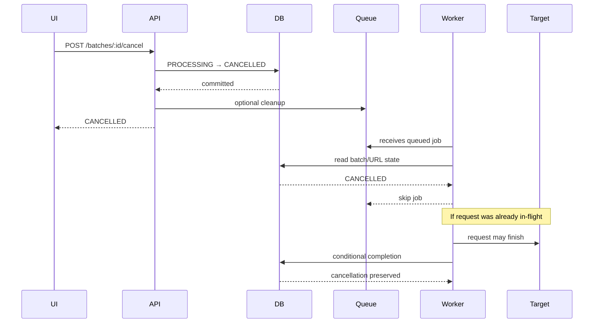

# URLPulse — Cancellation

**Version:** 1.0  
**Status:** Draft

---

# 1. Purpose

This document defines how a running URL-checking batch is cancelled safely.

Cancellation is a distributed state transition involving:

- API requests
- PostgreSQL
- BullMQ
- Workers
- In-flight HTTP requests
- Live frontend updates

The key requirement is:

> A stale worker must not undo an accepted cancellation.

---

# 2. Cancellation Goals

When a user cancels a batch:

1. New work should stop being started.
2. Queued work should be prevented from executing where possible.
3. In-flight requests should be handled safely.
4. Persisted state must remain internally consistent.
5. The UI should receive the updated state.
6. Cancellation must be safe under repeated requests.
7. Worker/API races must resolve deterministically.

---

# 3. Cancellation State

Batch state:

```text
PENDING ─┐
         ├─→ CANCELLED
PROCESSING ┘
```

A batch may be cancelled from either `PENDING` (queued, not yet started) or `PROCESSING` (ADR-026).

`CANCELLED` is terminal for that execution of the batch.

A cancelled batch must not transition back to `PROCESSING` because a stale worker discovered old state.

---

# 4. URL Cancellation

A batch may contain URLs in different states at cancellation time:

```text
SUCCESS
PROCESSING
PENDING
FAILED
```

The intended result is:

```text
SUCCESS     → SUCCESS
PROCESSING  → cancellation-aware terminal handling
PENDING     → CANCELLED
FAILED      → FAILED / existing terminal result
```

The exact representation of failed URLs should remain consistent with the retry-failed contract.

---

# 5. API Cancellation Flow

```text
POST /batches/:batchId/cancel
          ↓
Load batch
          ↓
Conditional state transition
          ↓
Batch = CANCELLED
          ↓
Prevent future work
          ↓
Invalidate cache
          ↓
Publish update
          ↓
Return current state
```

The database transition is authoritative.

---

# 6. Conditional Cancellation

Do not rely only on:

```text
SELECT batch
if status == PROCESSING
UPDATE batch
```

Another request or worker can change state between those operations.

Prefer a conditional transition:

```sql
UPDATE batches
SET
    status = 'CANCELLED',
    cancelled_at = NOW(),
    updated_at = NOW()
WHERE id = $1
  AND status IN ('PENDING', 'PROCESSING');
```

The result tells the API whether it won the state transition. In the same transaction, non-terminal
URLs are cancelled and `SUCCESS`/`FAILED` URLs are left unchanged:

```sql
UPDATE urls
SET status = 'CANCELLED', updated_at = NOW()
WHERE batch_id = $1
  AND status IN ('PENDING', 'PROCESSING');
```

This makes a stale worker's later `WHERE status = 'PROCESSING'` completion affect zero rows, so
cancellation wins the race (ADR-026).

---

# 7. Repeated Cancellation

Example:

```text
Request A → CANCEL
Request B → CANCEL
```

Only one request should need to perform the transition.

The second request should observe:

```text
status = CANCELLED
```

and return the current state without causing additional side effects.

---

# 8. Queued Jobs

Cancellation should prevent queued jobs from starting.

There are two possible approaches:

### Remove jobs from BullMQ

Advantages:

- Less unnecessary worker work

Disadvantages:

- Race-prone
- Jobs may already be executing
- Queue removal is not enough to establish authoritative state

### Leave jobs and make workers cancellation-aware

Advantages:

- PostgreSQL remains authoritative
- Safe against races
- Simpler correctness model

### Decision

Workers must always check authoritative database state before starting work.

Queue cleanup can be used as an optimization, but correctness must not depend on it.

---

# 9. Worker Cancellation Check

When a worker receives a job:

```text
Receive job
    ↓
Load URL + batch
    ↓
Is batch CANCELLED?
    ↓
Yes → do not perform HTTP request
```

This prevents stale queued jobs from consuming outbound request capacity.

---

# 10. Cancellation During HTTP Request

Hard case:

```text
Worker
  ↓
starts HTTP request

User
  ↓
cancels batch

API
  ↓
batch = CANCELLED

Worker
  ↓
HTTP request finishes
```

The worker cannot assume that the request result should become the final URL result.

The completion transaction must check current state.

---

# 11. Race Resolution

The database decides which state transition wins.

### Case A — Completion commits first

```text
Worker:
PROCESSING → SUCCESS

Then:
CANCEL request
```

The cancellation endpoint observes the updated state and applies the documented policy for an already-completed batch.

### Case B — Cancellation commits first

```text
Cancel:
PROCESSING → CANCELLED

Then:
Worker completion
```

The worker's conditional completion must fail to overwrite cancellation.

This is the critical invariant.

---

# 12. Never Use Blind Updates

Unsafe:

```sql
UPDATE urls
SET status = 'SUCCESS'
WHERE id = $1;
```

A stale worker could execute this after cancellation.

Safe design requires the transition to be conditional on the current state and applicable batch state.

---

# 13. Transactional Worker Completion

Conceptually:

```text
BEGIN

Read/lock current URL + batch state

If cancellation has won:
    preserve cancellation
Else if URL can transition:
    write SUCCESS
    update counters

COMMIT
```

The implementation should use the smallest transaction necessary to maintain correctness.

---

# 14. In-Flight HTTP Abort

If the HTTP client supports cancellation through `AbortController`, the worker may attempt to abort in-flight requests when cancellation becomes known.

However:

> Aborting the HTTP request is an optimization, not the correctness mechanism.

Even if the request cannot be aborted, the database state machine must still prevent a stale result from corrupting the batch.

---

# 15. Concurrency Slots

If an in-flight request is cancelled/aborted, its concurrency slot must be released.

The worker must use structured cleanup:

```ts
try {
  // request
} finally {
  // release concurrency resource
}
```

A leaked semaphore slot could eventually stall the entire worker pool.

---

# 16. Rate-Limit Permits

A rate-limit permit represents permission to start an outbound request.

Once an outbound request has started, cancellation does not retroactively restore that consumed rate-limit opportunity.

Therefore:

```text
permit acquired
→ request starts
→ cancellation
```

still counts as one outbound request.

---

# 17. Batch Completion After Cancellation

A cancelled batch should become terminal once cancellation is accepted according to the product state model.

Workers finishing afterward must not move the batch to:

```text
COMPLETED
```

or:

```text
PROCESSING
```

unless an explicit future product decision introduces resumable cancellation.

---

# 18. Retry Interaction

Cancellation must also stop retries.

Example:

```text
URL fails
→ BullMQ schedules retry
→ user cancels batch
→ delayed retry becomes due
```

The worker must check current state before performing another HTTP request.

Thus:

```text
job exists ≠ permission to execute job
```

---

# 19. Retry-Failed After Cancellation

A cancelled batch should not automatically restart.

If the user explicitly invokes retry-failed later, the API must follow the retry-failed state rules.

This is an explicit user action rather than an automatic continuation of cancelled work.

---

# 20. SSE / Live Updates

After cancellation:

```text
Database state changes
        ↓
publish batch.updated
        ↓
connected clients update UI
```

The frontend should display cancellation immediately when the authoritative event arrives.

If the client misses the event:

```text
refresh / reconnect
        ↓
GET /batches/:id
        ↓
recover authoritative state
```

---

# 21. Cache Invalidation

Cancellation is a state-changing operation.

Therefore relevant cached batch data must be invalidated or otherwise prevented from serving stale cancellation state beyond the intended cache policy.

---

# 22. Cancellation Idempotency

These requests:

```text
POST cancel
POST cancel
POST cancel
```

must not produce:

```text
CANCELLED
→ PROCESSING
→ CANCELLED
```

or duplicate events/counter changes.

The terminal state should remain stable.

---

# 23. Failure During Cancellation

If the database update fails:

```text
POST cancel
↓
database error
```

the API should return an error and must not claim cancellation succeeded.

The client can retry the operation.

This is preferable to returning success based on an in-memory assumption.

---

# 24. Worker/Queue Failure

Cancellation correctness must not depend on successfully deleting every BullMQ job.

If queue cleanup fails:

```text
Job remains
↓
Worker receives it
↓
Worker checks PostgreSQL
↓
Batch = CANCELLED
↓
Skip outbound request
```

This provides a correctness fallback.

---

# 25. Cancellation Sequence



---

# 26. Required Invariants

1. A cancelled batch cannot be reverted by a stale worker.
2. Queued jobs must not start new HTTP requests after cancellation is known.
3. In-flight requests may finish, but their results cannot blindly overwrite cancellation.
4. Cancellation is idempotent.
5. Retry jobs also respect cancellation.
6. Queue cleanup is an optimization, not the source of truth.
7. Database state is authoritative.
8. Concurrency resources are always released.
9. Cancellation updates are visible through live updates.
10. Refresh/reconnect reconstructs cancellation state from PostgreSQL.

---

# 27. Testing

Minimum tests:

### Cancel pending batch

```text
PROCESSING
→ CANCELLED
```

### Cancel with queued jobs

Verify queued workers do not perform HTTP requests.

### Cancel during request

Verify a stale successful response does not incorrectly revert state.

### Concurrent cancellation

Two cancel requests result in one stable state.

### Cancel + retry race

Verify cancellation does not accidentally trigger retry processing.

### Worker restart

Verify stale jobs after cancellation are skipped.

### SSE

Verify connected clients receive the cancellation update.

---

# 28. Related Documents

```text
docs/03-backend/database.md
docs/03-backend/job-lifecycle.md
docs/03-backend/api.md
docs/03-backend/rate-limiting.md
docs/03-backend/retries-and-idempotency.md
docs/04-frontend/live-updates.md
docs/06-quality/testing.md
```
