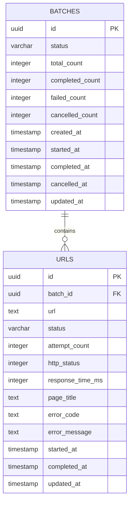

# URLPulse - Database Design

**Version:** 1.0  
**Status:** Draft  
**Database:** PostgreSQL

---

## 1. Purpose

This document defines the PostgreSQL data model for URLPulse.

PostgreSQL is the authoritative source of application state. Queue state, Redis state, frontend state, and live events must not be treated as substitutes for durable application state.

The schema is designed around two primary domain entities:

- `batches`
- `urls`

A batch owns multiple URL records. Each URL record represents one independently processable URL within that batch.

---

## 2. Design Goals

The database design must support:

- Durable batch state
- Durable URL state
- Independent URL processing
- Retry attempts
- Idempotent job completion
- Cancellation races
- Retry-failed
- Progress reconstruction after refresh
- Direct batch navigation
- Concurrent workers
- Audit-friendly timestamps

The schema should keep the source of truth simple enough to reason about and maintain.

---

## 3. Entity Relationship



---

# 4. `batches`

The `batches` table represents a submitted URL-checking operation.

## Columns

| Column | Type | Nullable | Description |
|---|---|---:|---|
| `id` | UUID | No | Unique batch identifier |
| `user_id` | text | Yes | Owning user (`"user".id`); set from the session on create. See §4.3 |
| `status` | enum/text | No | Current batch lifecycle state |
| `total_count` | integer | No | Total URLs in batch |
| `completed_count` | integer | No | URLs completed successfully |
| `failed_count` | integer | No | URLs currently failed |
| `cancelled_count` | integer | No | URLs cancelled/skipped |
| `created_at` | timestamp | No | Batch creation time |
| `started_at` | timestamp | Yes | Processing start time |
| `completed_at` | timestamp | Yes | Terminal completion time |
| `cancelled_at` | timestamp | Yes | Cancellation time |
| `updated_at` | timestamp | No | Last state update |

---

## 4.1 Batch Status

Initial state model:

```text
PENDING
   ↓
PROCESSING
   ├──────────────→ COMPLETED
   ├──────────────→ FAILED
   └──────────────→ CANCELLED
```

The exact transition rules are defined in `job-lifecycle.md`.

---

## 4.2 Ownership

`user_id` references the Better Auth `"user"` table (`ON DELETE CASCADE`) and is
set from the authenticated session when a batch is created — never from the
request body. Every batch read and mutation filters `WHERE user_id = <session
user>`, so a user only ever sees or changes their own batches; a batch owned by
someone else is reported as `404`, not leaked.

The column is nullable so the migration is safe against pre-auth rows: a batch
with no owner matches no user and is simply invisible. The application always
sets `user_id` on new batches. Auth tables and this column are added in
migrations `0002`/`0003`; see `docs/03-backend/authentication.md`.

---

## 4.4 Why Store Counters?

Counters make batch progress queries cheap.

For example:

```text
completed_count / total_count
```

can be returned without repeatedly scanning every URL row.

However, counters introduce a consistency concern.

Therefore counter changes must be performed transactionally with the URL state transition that caused the counter change.

The database remains authoritative.

---

# 5. `urls`

The `urls` table represents an individual URL within a batch.

Each row is independently processable.

## Columns

| Column | Type | Nullable | Description |
|---|---|---:|---|
| `id` | UUID | No | Unique URL record identifier |
| `batch_id` | UUID | No | Parent batch |
| `url` | text | No | Submitted URL |
| `status` | enum/text | No | URL processing state |
| `attempt_count` | integer | No | Number of processing attempts |
| `http_status` | integer | Yes | Final HTTP status code |
| `response_time_ms` | integer | Yes | Response time |
| `page_title` | text | Yes | Extracted page title |
| `error_code` | text | Yes | Normalized error category |
| `error_message` | text | Yes | Human-readable diagnostic |
| `started_at` | timestamp | Yes | Processing start |
| `completed_at` | timestamp | Yes | Processing completion |
| `updated_at` | timestamp | No | Last state update |

---

# 6. URL Status

Initial URL state model:

```text
PENDING
   ↓
PROCESSING
   ├──────────────→ SUCCESS
   ├──────────────→ FAILED
   └──────────────→ CANCELLED

FAILED
   ↓
PENDING
   ↓
PROCESSING
```

A failed URL can be retried.

A successful URL is not selected by retry-failed.

A cancelled URL is not automatically retried unless explicitly supported by a later product decision.

---

# 7. Foreign Key

Every URL belongs to exactly one batch.

```text
urls.batch_id → batches.id
```

The foreign key should use appropriate delete behavior.

The preferred behavior is to avoid accidental cascading deletion of application state. Batch deletion is not part of the initial product scope.

---

# 8. Duplicate URLs

The same URL may appear more than once in a submitted batch unless product validation explicitly chooses to deduplicate it.

Initial design:

```text
Batch
 ├── https://example.com
 ├── https://example.com
 └── https://example.com
```

Each row is independently trackable.

This avoids silently changing user input.

If deduplication is later desired, it should be an explicit product decision rather than an accidental database constraint.

---

# 9. Indexes

At minimum:

### Batch listing

```sql
CREATE INDEX idx_batches_created_at
ON batches (created_at DESC);
```

### URL lookup by batch

```sql
CREATE INDEX idx_urls_batch_id
ON urls (batch_id);
```

### URL state within batch

```sql
CREATE INDEX idx_urls_batch_status
ON urls (batch_id, status);
```

These support the primary application queries.

---

# 10. Constraints

The database should enforce basic invariants.

Examples:

```text
total_count >= 0
completed_count >= 0
failed_count >= 0
cancelled_count >= 0
attempt_count >= 0
response_time_ms >= 0 when present
http_status between 100 and 599 when present
```

The application should also validate that:

```text
completed_count
+ failed_count
+ cancelled_count
<= total_count
```

The exact representation of processing/in-flight URLs should be finalized alongside the state machine.

---

# 11. Transaction Boundaries

Important state transitions should be performed within database transactions.

Example successful completion:

```text
BEGIN

1. Lock/read URL state as required
2. Verify URL can transition to SUCCESS
3. Update URL result
4. Increment successful progress
5. Recalculate/update batch state if terminal

COMMIT
```

This prevents the URL result and batch progress from becoming independently inconsistent.

---

# 12. Idempotent Completion

A worker must not blindly execute:

```sql
UPDATE urls
SET status = 'SUCCESS'
WHERE id = $1;
```

because the same job may execute more than once.

Instead, the update must be conditional on the URL still being in a state that allows the transition.

Conceptually:

```sql
UPDATE urls
SET
    status = 'SUCCESS',
    ...
WHERE id = $1
  AND status = 'PROCESSING';
```

If zero rows are affected, the worker must treat the transition as already handled or no longer valid.

This is particularly important for:

- Duplicate jobs
- Cancellation races
- Worker retries
- Worker restarts

---

# 13. Cancellation Race

Consider:

```text
Worker                     API

URL = PROCESSING

                           Cancel batch
                           ↓
                           Batch = CANCELLED

Worker finishes request
↓
Attempts SUCCESS
```

The worker must not blindly overwrite the cancelled state.

The final transition must check the authoritative state and apply the documented transition rules.

The detailed cancellation behavior is defined in:

```text
docs/03-backend/cancellation.md
```

---

# 14. Progress Reconstruction

The UI must be able to reconstruct batch state from PostgreSQL.

For example:

```text
GET /batches/:id
```

should return enough persisted information to determine:

- Total URLs
- Completed URLs
- Failed URLs
- Cancelled URLs
- Current batch status
- Individual URL results

This allows the application to recover after:

- Browser refresh
- SSE disconnect
- API restart
- Worker restart

---

# 15. Counter Strategy

There are two possible approaches:

### Option A - Derived counters

Calculate counts from URL rows.

Advantages:

- Simple source of truth
- No counter drift

Disadvantages:

- Potentially more database work

### Option B - Persisted counters

Store counters on `batches`.

Advantages:

- Fast reads
- Simple progress queries

Disadvantages:

- Requires careful transactional updates
- Counters can drift if implementation is incorrect

### Decision

Use persisted counters together with transactional URL state transitions.

The implementation must include tests that detect counter drift.

---

# 16. Timestamp Semantics

Timestamps should use UTC.

Recommended fields:

```text
created_at
updated_at
started_at
completed_at
cancelled_at
```

The API converts timestamps into the representation required by the frontend.

---

# 17. Result Semantics

A successful URL result may contain:

```text
HTTP status
Response time
Page title
```

A failed result may contain:

```text
Error code
Error message
Attempt count
```

The schema should allow missing optional result fields without treating them as database errors.

---

# 18. Migration Strategy

Database schema changes must be represented as migrations.

The repository should not rely on manually editing a production database.

Migration history should be reproducible for a fresh environment.

---

# 19. Database Invariants

The following invariants are important:

### Batch ownership

Every URL belongs to an existing batch.

### Counter integrity

Batch counters represent persisted URL outcomes.

### Terminal states

Terminal batches do not unexpectedly return to active processing.

### Retry selection

Retry-failed selects only eligible failed URLs.

### Cancellation

Cancellation cannot be silently overwritten by a stale worker update.

### Idempotency

Repeating a completion transition does not double-count progress.

---

# 20. Future Extensions

The schema intentionally does not include:

- Users
- Authentication
- Scheduled checks
- Monitoring history
- Notifications
- Organizations
- Billing

Those are outside the current product scope.

---

# 21. Related Documents

```text
docs/01-product/PRD.md
docs/01-product/requirements.md
docs/01-product/scope.md
docs/02-architecture/architecture.md
docs/03-backend/api.md
docs/03-backend/job-lifecycle.md
docs/03-backend/retries-and-idempotency.md
docs/03-backend/cancellation.md
```
