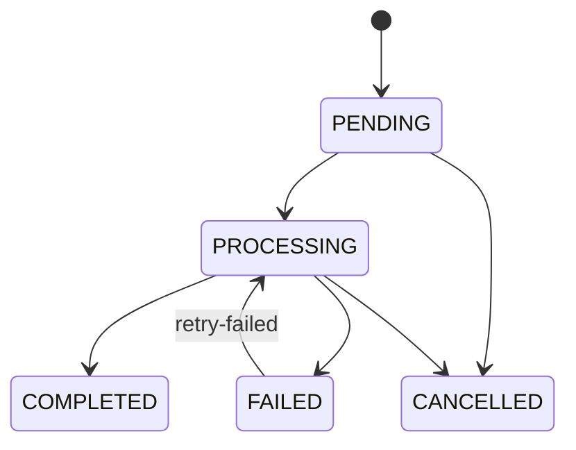
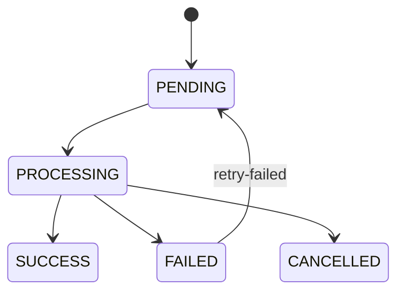
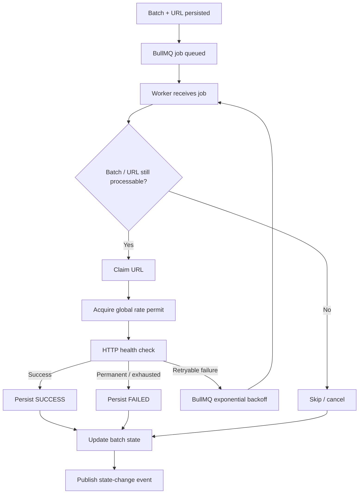

# URLPulse — Job Lifecycle

**Version:** 1.0  
**Status:** Draft  
**Queue:** BullMQ  
**Persistence:** PostgreSQL

---

# 1. Purpose

This document defines the lifecycle of URL-processing jobs and the relationship between:

- Batch state
- URL state
- BullMQ jobs
- Worker execution
- Retries
- Cancellation
- Completion

The key design principle is:

> BullMQ represents work to be performed. PostgreSQL represents what actually happened.

The queue is therefore not the source of truth for application state.

---

# 2. Processing Model

Each URL gets an independent background job.

Example:

```text
Batch A
│
├── URL 1 → Job 1
├── URL 2 → Job 2
├── URL 3 → Job 3
└── URL 4 → Job 4
```

Jobs can complete independently.

A slow or failed URL should not prevent unrelated URLs from progressing.

---

# 3. Batch Lifecycle

The initial batch lifecycle is:



`PENDING → CANCELLED` covers cancelling a batch before processing starts (ADR-026).
`FAILED → PROCESSING` covers `retry-failed` reactivating a batch that had failed URLs (ADR-024).

The batch terminal transition is owned by the worker that persists the final URL transition, in the
same transaction, with precedence `CANCELLED > FAILED > COMPLETED` once
`completed + failed + cancelled = total` (ADR-025).

---

## 3.1 PENDING

A batch is `PENDING` after it has been persisted but before processing has meaningfully started.

During creation:

```text
Create batch
↓
Create URL rows
↓
Commit transaction
↓
Enqueue jobs
```

The batch must exist in PostgreSQL before workers can process its URLs.

---

## 3.2 PROCESSING

The batch enters `PROCESSING` when URL processing begins.

A batch can contain URLs in different states simultaneously.

Example:

```text
Batch = PROCESSING

URL A = SUCCESS
URL B = PROCESSING
URL C = PENDING
URL D = FAILED
```

The batch remains active until all relevant URL work reaches a terminal state.

---

## 3.3 COMPLETED

A batch becomes `COMPLETED` when all URLs have completed successfully.

Conceptually:

```text
successful + failed + cancelled = total
```

and:

```text
failed = 0
cancelled = 0
```

The exact terminal transition should be evaluated transactionally.

---

## 3.4 FAILED

A batch becomes `FAILED` when processing reaches a terminal state with one or more failed URLs and no remaining eligible work.

Example:

```text
URL A = SUCCESS
URL B = SUCCESS
URL C = FAILED
URL D = SUCCESS
```

The batch may become:

```text
FAILED
```

The failed URL remains available for retry-failed.

---

## 3.5 CANCELLED

A batch becomes `CANCELLED` after a user cancellation request is accepted and persisted.

Queued work should stop progressing.

Already-running workers may need to finish or be interrupted depending on the HTTP request implementation.

Regardless of transport behavior, stale worker results must not incorrectly revert the batch.

---

# 4. URL Lifecycle

The URL lifecycle is:



---

# 5. PENDING

A URL is `PENDING` when:

- It has been persisted
- It has not yet started processing

A URL can also return to `PENDING` when retry-failed schedules a new attempt.

---

# 6. PROCESSING

A worker claims the URL and transitions it to `PROCESSING`.

The worker should record the processing start time.

The transition must be safe against duplicate job execution.

Conceptually:

```sql
UPDATE urls
SET
    status = 'PROCESSING',
    started_at = NOW(),
    attempt_count = attempt_count + 1
WHERE id = $1
  AND status = 'PENDING';
```

If the update affects zero rows, the worker must inspect the current state rather than assuming it owns the URL.

---

# 7. SUCCESS

A URL becomes `SUCCESS` after a successful health check.

The worker persists:

- HTTP status
- Response time
- Page title
- Completion timestamp

The success transition and corresponding batch counter update should happen in one database transaction.

---

# 8. FAILED

A URL becomes `FAILED` when the current processing attempt reaches a terminal failure condition.

Not every failure should necessarily immediately become terminal.

Transient failures may be handed back to BullMQ for retry.

Conceptually:

```text
HTTP attempt
     │
     ├── Success ──> SUCCESS
     │
     ├── Retryable failure
     │        ↓
     │   BullMQ retry
     │
     └── Permanent / exhausted
              ↓
            FAILED
```

---

# 9. CANCELLED

A URL may become `CANCELLED` when its parent batch has been cancelled and the URL has not successfully completed.

Cancellation behavior for an already-running URL must be handled carefully because an HTTP request may already be in progress.

---

# 10. Job Identity

A job must contain enough information to identify the URL it processes.

Recommended payload:

```ts
type UrlCheckJob = {
  urlId: string;
  batchId: string;
};
```

The URL ID is the authoritative application identifier.

The worker should load current URL state from PostgreSQL rather than trusting mutable state stored only inside the job payload.

---

# 11. Job Creation

When a batch is created:

```text
BEGIN
    Insert batch
    Insert URL rows
COMMIT

Enqueue jobs
```

The implementation must ensure that a job is not intentionally processed against uncommitted URL state.

---

# 12. Queueing Failure

A subtle failure case exists:

```text
Database transaction succeeds
        ↓
Queue enqueue fails
```

This can leave persisted URLs without corresponding jobs.

The implementation should explicitly address this possibility.

For the initial implementation, the chosen strategy and trade-off must be documented.

Possible approaches include:

- Transactional outbox
- Reliable enqueue with reconciliation
- Insert + enqueue with recovery mechanism

The project should choose the simplest approach that provides an acceptable correctness guarantee within scope.

---

# 13. Worker Execution

A worker performs the following conceptual sequence:

```text
Receive BullMQ job
        ↓
Load URL + batch state
        ↓
Check whether processing is still allowed
        ↓
Claim URL
        ↓
Check cancellation
        ↓
Acquire global rate-limit permit
        ↓
Perform HTTP request
        ↓
Classify result
        ↓
Persist result transactionally
        ↓
Publish state-change event
```

The worker should not trust a job's existence as proof that processing is still valid.

---

# 14. Claiming a Job

Before performing the external request, the worker should establish that the URL can still transition from `PENDING` to `PROCESSING`.

This prevents stale jobs from executing work that is no longer wanted.

Example:

```text
Job exists
   ↓
URL = CANCELLED
   ↓
Do not make HTTP request
```

---

# 15. Cancellation Before Start

If the batch has been cancelled before a queued URL begins:

```text
Worker receives job
       ↓
Read batch state
       ↓
Batch = CANCELLED
       ↓
Do not make HTTP request
```

The URL should transition to the appropriate terminal cancellation state if required by the chosen data model.

---

# 16. Cancellation During Processing

More difficult case:

```text
Worker
  ↓
HTTP request starts

User
  ↓
Cancel batch

Worker
  ↓
HTTP request finishes
```

The worker must not blindly mark the URL successful.

Instead, its completion transaction must evaluate the current authoritative state.

Possible policy:

```text
If cancellation won the state race:
    preserve cancellation
else:
    accept successful completion
```

The exact conditional SQL/state transition belongs in `cancellation.md`.

---

# 17. Retry Lifecycle

For retryable failures:

```text
PROCESSING
    ↓
transient failure
    ↓
BullMQ backoff
    ↓
new attempt
    ↓
PROCESSING
```

The URL should not be permanently marked `FAILED` until retries are exhausted or the failure is classified as non-retryable.

---

# 18. Retry Count

The system supports up to:

```text
3 retries
```

The implementation must clearly distinguish:

- Initial attempt
- Retry attempt 1
- Retry attempt 2
- Retry attempt 3

This prevents accidental interpretation of "3 retries" as "3 total attempts."

---

# 19. Exponential Backoff

The retry delay follows an exponential pattern.

Conceptually:

```text
retry 1 → base delay
retry 2 → base × 2
retry 3 → base × 4
```

A small amount of jitter may be added to avoid synchronized retries.

The exact values should be documented in:

```text
docs/03-backend/retries-and-idempotency.md
```

---

# 20. Successful Retry

If a retry succeeds:

```text
PROCESSING
    ↓
SUCCESS
```

Only one successful completion should affect batch counters.

Duplicate completion attempts must become no-ops.

---

# 21. Failed Retry Exhaustion

If all allowed retries are exhausted:

```text
PROCESSING
    ↓
FAILED
```

The final error information is persisted.

The URL then becomes eligible for the user-triggered retry-failed operation.

---

# 22. Batch Completion

Batch state should be derived from the terminal state of its URLs.

Example:

```text
100 total
100 SUCCESS
```

→ `COMPLETED`

Example:

```text
100 total
97 SUCCESS
3 FAILED
```

→ `FAILED`

Example:

```text
100 total
80 SUCCESS
20 CANCELLED
```

→ `CANCELLED`

The exact precedence rules must be deterministic and documented.

---

# 23. Retry Failed

When a user invokes retry-failed:

```text
Batch
│
├── SUCCESS → unchanged
├── SUCCESS → unchanged
├── FAILED  → PENDING
└── FAILED  → PENDING
```

New BullMQ jobs are created only for those failed URL records.

The batch transitions back into an active processing state if work is accepted.

---

# 24. Idempotency

A worker may encounter:

```text
Same job
↓
executed twice
```

The second execution must not:

- Increment progress twice
- Replace a newer result
- Undo cancellation
- Cause invalid batch transitions

Database conditional updates and transactions provide the primary protection.

---

# 25. Duplicate Job Example

Suppose:

```text
URL A = PROCESSING
```

Worker 1 completes:

```text
PROCESSING → SUCCESS
```

Worker 2 later executes the same job.

Worker 2 attempts:

```text
PROCESSING → SUCCESS
```

The conditional transition affects zero rows because the URL is already `SUCCESS`.

Worker 2 must not increment counters.

---

# 26. Worker Restart

If a worker process terminates unexpectedly:

```text
Worker dies
   ↓
BullMQ retains/requeues eligible job
   ↓
Another worker receives job
   ↓
Worker checks PostgreSQL state
   ↓
Processing continues safely
```

The application should not rely on process memory to recover URL state.

---

# 27. Event Publication

After a successful database transition, the worker publishes a state-change notification.

Important ordering:

```text
Persist state
    ↓
Publish event
```

not:

```text
Publish event
    ↓
Persist state
```

Otherwise clients may observe an event for state that was never committed.

---

# 28. Event Payload

Events should be small and versionable.

Example:

```ts
type BatchUpdatedEvent = {
  type: "batch.updated";
  batchId: string;
  urlId?: string;
  version: number;
};
```

The event should not need to contain the entire batch.

Clients can fetch authoritative state when necessary.

---

# 29. Job Lifecycle Summary



---

# 30. Important Invariants

The implementation must preserve these invariants:

1. A URL cannot be successfully completed twice.
2. A duplicate job cannot double-count progress.
3. A cancelled batch cannot be reverted by a stale worker.
4. Successful URLs are not selected by retry-failed.
5. Retry attempts do not exceed the configured maximum.
6. Batch terminal state reflects terminal URL state.
7. Database state remains authoritative.
8. Events are published only after relevant state is persisted.
9. Worker processes do not depend on local memory for recovery.
10. Multiple workers can process jobs safely.

---

# 31. Related Documents

```text
docs/03-backend/database.md
docs/03-backend/api.md
docs/03-backend/rate-limiting.md
docs/03-backend/retries-and-idempotency.md
docs/03-backend/cancellation.md
docs/04-frontend/live-updates.md
docs/05-infrastructure/scaling.md
```
