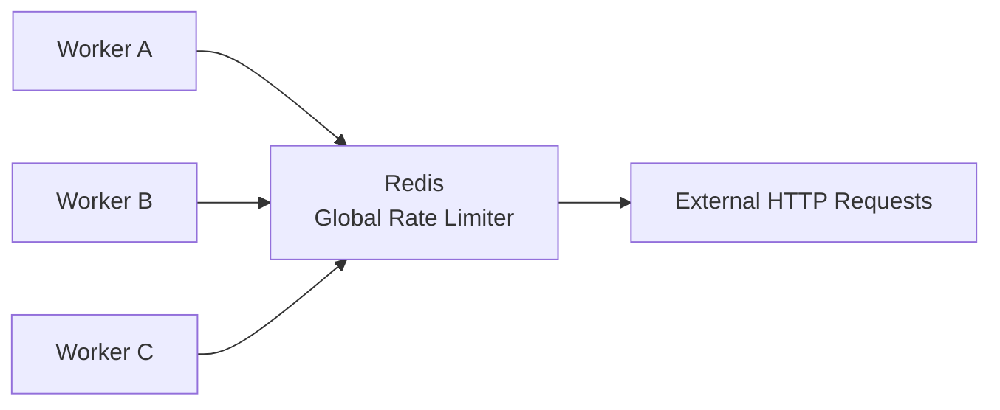

# URLPulse — Global Rate Limiting

**Version:** 1.0  
**Status:** Draft  
**Requirement:** Maximum 10 HTTP requests/second globally

---

# 1. Purpose

URLPulse must enforce a maximum of:

```text
10 outbound HTTP requests per second
```

across the entire system.

This is a distributed-system requirement.

It must remain true when:

- Multiple workers are running
- Multiple API instances are running
- Jobs are retried
- Several batches are processed concurrently

---

# 2. Critical Distinction

The following are different constraints:

```text
Rate limit:
<= 10 HTTP requests/sec globally

Concurrency:
<= 5 URL checks in flight
```

A system can satisfy one while violating the other.

Both must be enforced.

---

# 3. Why Worker-Local Rate Limiting Is Incorrect

Consider:

```text
Worker A → 10 req/sec
Worker B → 10 req/sec
Worker C → 10 req/sec
```

A local limiter would permit:

```text
30 req/sec
```

This violates the global requirement.

Therefore rate-limit state must be shared.

---

# 4. Chosen Architecture

URLPulse uses a Redis-backed distributed rate limiter.

Conceptually:



All workers coordinate through the same Redis-backed limiter.

---

# 5. Why Redis?

Redis is already required for BullMQ.

It provides:

- Shared state
- Atomic operations
- Low-latency access
- Cross-process coordination

Using the existing Redis infrastructure avoids introducing another distributed coordination system.

---

# 6. Algorithm

The preferred design is a Redis-backed sliding-window or equivalent atomic limiter.

The logical rule is:

```text
At any request-admission decision:
    count requests in the active window

If count < 10:
    admit request
Else:
    wait
```

The implementation must make the check-and-record operation atomic.

A naïve sequence such as:

```text
GET count
IF count < 10
INCR count
```

is unsafe because multiple workers can race between the read and increment.

---

# 7. Atomicity

The limiter must perform admission atomically.

Conceptually:

```text
Worker A ─┐
Worker B ─┼─> atomic Redis operation ─> permit / wait
Worker C ─┘
```

Possible implementation mechanisms include:

- Redis Lua script
- Redis atomic primitives
- A proven distributed rate-limiter implementation

The final implementation should prefer a small, auditable mechanism over unnecessary abstraction.

---

# 8. Permit Location

The rate-limit permit should be acquired immediately before the outbound HTTP request.

Correct:

```text
Job
 ↓
Concurrency slot
 ↓
Acquire rate-limit permit
 ↓
HTTP request
```

This makes the limiter directly represent the outbound HTTP request rate.

---

# 9. What Does Not Count as an HTTP Request?

The rate limiter applies to actual outbound URL health-check HTTP requests.

These should not consume permits:

- PostgreSQL queries
- Redis commands
- BullMQ operations
- API requests from the browser to URLPulse
- Internal service communication

Only the external URL-checking HTTP operation consumes a permit.

---

# 10. Concurrency Interaction

The worker should acquire both:

```text
Concurrency slot
+
Rate-limit permit
```

before starting the outbound request.

Conceptually:

```text
                 ┌──> concurrency slot
Job ─────────────┤
                 └──> rate permit
                         ↓
                    HTTP request
```

The exact ordering can be optimized, but the implementation must avoid holding scarce resources unnecessarily.

---

# 11. Global Guarantee

With:

```text
Worker A
Worker B
Worker C
```

the combined request rate must remain:

```text
<= 10 requests/sec
```

not:

```text
10 × worker count
```

---

# 12. Multiple Batches

The limit applies across all batches.

Example:

```text
Batch A → 6 requests/sec
Batch B → 4 requests/sec
```

Total:

```text
10 requests/sec
```

Another batch must wait until capacity is available.

There is no separate 10 req/sec budget per batch.

---

# 13. Retry Interaction

Retries are new outbound HTTP requests.

Therefore a retry must acquire a new rate-limit permit.

Example:

```text
Attempt 1
   ↓
Rate permit
   ↓
HTTP request
   ↓
Transient failure
   ↓
Backoff
   ↓
Attempt 2
   ↓
New rate permit
   ↓
HTTP request
```

A BullMQ retry must never bypass the global limiter.

---

# 14. Failed Requests

A request that fails at the network level still consumed an outbound request opportunity.

Therefore:

```text
HTTP request started
↓
network failure
```

still consumes one rate-limit permit.

The limiter controls admission to outbound work, not successful responses.

---

# 15. Redirects

Redirect behavior must be explicitly defined by the HTTP client configuration.

The implementation should determine whether redirects are followed automatically.

If one logical URL check can generate multiple outbound HTTP requests because of redirects, the rate-limit accounting must be consistent with the actual outbound request behavior.

This decision must be finalized before implementation.

---

# 16. Redis Failure

Redis is part of the control plane for rate limiting.

If Redis is unavailable, the system must not silently fall back to independent worker-local rate limiters because that could violate the global requirement.

Preferred behavior:

```text
Redis unavailable
       ↓
Cannot safely acquire global permit
       ↓
Do not start outbound HTTP request
       ↓
Retry/recover according to infrastructure policy
```

This favors correctness over availability.

---

# 17. Clock Considerations

The implementation must avoid depending on unsynchronized application-server clocks where possible.

Redis-side timestamps or another centralized time mechanism are preferable for a distributed window.

This reduces differences between workers running on separate machines.

---

# 18. Burst Behavior

The implementation must define how bursts are handled.

A strict sliding-window approach provides predictable semantics:

```text
At most 10 admitted requests
within the configured rolling interval.
```

A token-bucket approach could permit short bursts while preserving an average rate.

The implementation should favor behavior that is easy to explain and test.

---

# 19. Testing the Rate Limiter

Tests must include more than a single worker.

Minimum scenarios:

### Single worker

```text
100 jobs
→ never exceed 10 req/sec
```

### Multiple workers

```text
Worker A + Worker B + Worker C
→ combined rate never exceeds 10 req/sec
```

### Concurrent admission

Many workers request permits simultaneously.

The limiter must remain atomic.

### Retry load

Retries must consume permits like initial attempts.

### Redis unavailable

Workers must not silently bypass the limiter.

---

# 20. Observability

The system should make rate-limiting behavior visible during development.

Useful metrics/log fields:

```text
rateLimitWaitMs
workerId
jobId
batchId
urlId
permitGrantedAt
```

Logging every request may be noisy; structured sampling or debug-level logging can be used.

---

# 21. Concurrency vs Rate Limit Example

Suppose:

```text
5 checks are in flight
```

This does not mean the system may start another 5 immediately.

The next request still needs a global rate-limit permit.

Similarly:

```text
10 requests/sec
```

does not mean 10 simultaneous requests are allowed.

The concurrency limit may restrict the number in flight to 5.

---

# 22. Design Summary

```text
Requirement:
10 HTTP requests/sec globally

Mechanism:
Redis-backed distributed limiter

Scope:
Entire system

Workers:
All share the same limiter

Retries:
Consume new permits

Redis failure:
Do not bypass limiter

Source of truth:
PostgreSQL for application state

Concurrency:
Separate 5-check control
```

---

# 23. Related Documents

```text
docs/02-architecture/architecture.md
docs/03-backend/database.md
docs/03-backend/job-lifecycle.md
docs/03-backend/retries-and-idempotency.md
docs/03-backend/cancellation.md
docs/05-infrastructure/scaling.md
docs/06-quality/testing.md
```
