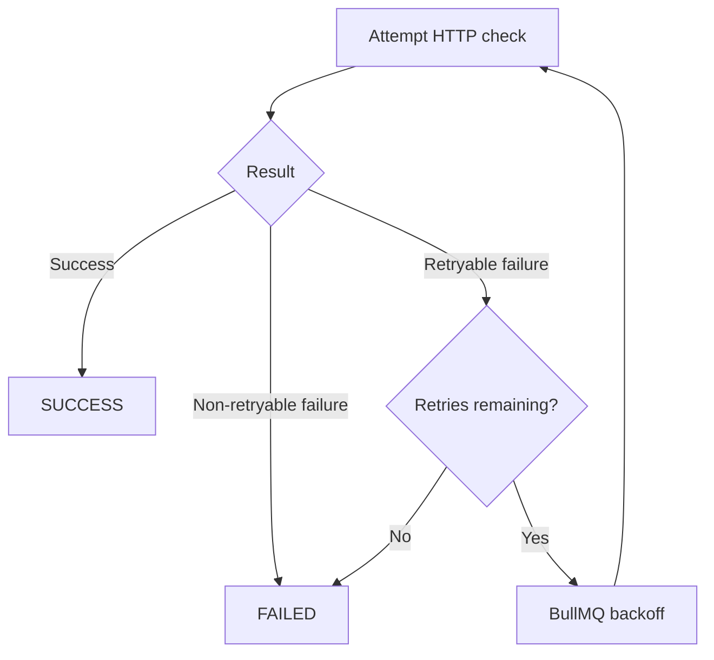

# URLPulse — Retries & Idempotency

**Version:** 1.0  
**Status:** Draft

---

# 1. Purpose

This document defines retry behavior and idempotency guarantees for URLPulse.

The system must tolerate transient failures, duplicate queue delivery, worker restarts, and concurrent operations without corrupting URL or batch state.

The central principle is:

> Retrying work must not create duplicate logical outcomes.

---

# 2. Retry Model

Each URL health check has:

```text
1 initial attempt
+
up to 3 retries
```

Therefore the maximum number of outbound HTTP attempts for one URL is:

```text
4 total attempts
```

This distinction is important:

```text
3 retries ≠ 3 total attempts
```

---

# 3. Retryable vs Non-Retryable Failures

Not every failure should be retried.

## Retryable examples

Typical transient conditions include:

- Connection timeout
- Temporary network failure
- Connection reset
- Temporary DNS/network failure
- HTTP 429
- Selected 5xx responses

The exact classification should be implemented centrally so workers do not make inconsistent decisions.

## Non-retryable examples

Typical permanent conditions include:

- Invalid URL
- Unsupported protocol
- Malformed request
- Deterministic validation failure

The implementation should document the exact HTTP status classification used.

---

# 4. Retry Flow



---

# 5. Exponential Backoff

Retry delays use exponential backoff.

Conceptually:

```text
Retry 1 → base delay
Retry 2 → 2 × base delay
Retry 3 → 4 × base delay
```

A small jitter may be added.

Example:

```text
base = 1 second

retry 1 ≈ 1s
retry 2 ≈ 2s
retry 3 ≈ 4s
```

The exact configured values belong in application configuration rather than being scattered through worker code.

---

# 6. Why Backoff?

Without backoff, a temporary outage can produce:

```text
failure
→ immediate retry
→ failure
→ immediate retry
→ failure
```

This increases pressure on an already unhealthy target.

Backoff gives the target and network time to recover.

---

# 7. Rate Limiter Interaction

Every retry is a new outbound HTTP request.

Therefore:

```text
retry
  ↓
global rate limiter
  ↓
HTTP request
```

A retry must never bypass the global 10 requests/sec limiter.

Retries also count toward the maximum 5 concurrent checks.

---

# 8. BullMQ Responsibility

BullMQ manages:

- Job delivery
- Retry scheduling
- Backoff
- Delayed jobs
- Worker execution

PostgreSQL manages:

- URL state
- Attempt count
- Final result
- Batch progress
- Cancellation state

Neither system should be treated as a replacement for the other.

---

# 9. Attempt Count

The URL record should maintain:

```text
attempt_count
```

The value represents the number of actual processing attempts.

Example:

```text
Initial attempt → attempt_count = 1
Retry 1         → attempt_count = 2
Retry 2         → attempt_count = 3
Retry 3         → attempt_count = 4
```

---

# 10. Idempotent Processing

Queue systems can deliver the same logical job more than once.

Possible causes:

- Worker crash
- Retry
- Network uncertainty
- Duplicate enqueue
- Worker restart

Therefore the worker must not assume:

```text
one job = exactly one execution
```

Instead:

```text
one URL state transition = exactly one logical outcome
```

---

# 11. Conditional State Transitions

State-changing updates should be conditional.

For example:

```sql
UPDATE urls
SET
    status = 'SUCCESS',
    http_status = $2,
    response_time_ms = $3,
    page_title = $4,
    completed_at = NOW(),
    updated_at = NOW()
WHERE id = $1
  AND status = 'PROCESSING';
```

If zero rows are updated, the worker must not increment progress again.

---

# 12. Why Application-Level Checks Are Insufficient

This is unsafe:

```text
SELECT status
       ↓
if status == PROCESSING
       ↓
UPDATE status
```

Two workers can observe `PROCESSING` simultaneously.

Instead, the transition itself must be protected by the database.

---

# 13. Transactional Completion

Successful completion should conceptually happen inside one transaction:

```text
BEGIN

Conditional URL transition
        ↓
If transition succeeded:
    increment batch counter
    evaluate batch terminal state

COMMIT
```

If the URL transition did not happen, no second counter increment should occur.

---

# 14. Duplicate Completion Example

Initial:

```text
URL A = PROCESSING
completed_count = 4
```

Worker 1:

```text
URL A → SUCCESS
completed_count = 5
```

Worker 2 receives duplicate execution:

```text
URL A already SUCCESS
```

Worker 2 must perform no additional state transition.

Final:

```text
completed_count = 5
```

not:

```text
completed_count = 6
```

---

# 15. Cancellation Race

A cancellation request can race with worker completion.

Example:

```text
Worker                  API

HTTP request
running

                        CANCEL batch
                        ↓
                        batch = CANCELLED

Worker receives result
```

The worker's final database transaction must check current authoritative state.

It must not blindly overwrite a cancellation that already won the state transition.

Detailed cancellation rules are defined in:

```text
docs/03-backend/cancellation.md
```

---

# 16. Retry-Failed Idempotency

The retry-failed endpoint can also be called multiple times.

Unsafe implementation:

```text
SELECT all FAILED
↓
enqueue all
```

Two simultaneous requests could enqueue the same failed URLs twice.

Preferred approach:

```text
Atomically claim eligible FAILED rows
        ↓
transition them to PENDING
        ↓
enqueue only claimed rows
```

The database determines which request successfully claimed each URL.

---

# 17. Duplicate Retry Jobs

Even after safe retry-failed selection, duplicate jobs may still exist.

The worker therefore retains its own idempotency protection.

```text
retry API idempotency
+
worker state-transition idempotency
```

Both layers are necessary.

---

# 18. Stale Jobs

A stale job may arrive after the URL has already become:

```text
SUCCESS
CANCELLED
FAILED
```

The worker must inspect current database state.

If the job is no longer valid:

```text
do not perform unnecessary HTTP work
do not mutate terminal state
```

---

# 19. Worker Crash

Consider:

```text
HTTP request succeeds
        ↓
worker crashes before database completion
```

The job may be retried.

The second worker can perform the HTTP request again.

This may produce two real outbound requests, but the database must still record only one logical completion.

This is an important distinction:

> Idempotency protects application state; it cannot necessarily prevent duplicate external side effects after an arbitrary worker crash.

The global rate limiter still applies to both outbound attempts.

---

# 20. Exactly-Once Semantics

The system should **not claim exactly-once external HTTP execution**.

Distributed workers cannot reliably guarantee that a request happened exactly once across arbitrary crashes and network failures.

The practical guarantee is:

```text
At-least-once job execution
+
idempotent database state transitions
+
correct final application state
```

This is a more accurate and defensible design.

---

# 21. Retry After Worker Restart

BullMQ should retain retryable work according to its configured job semantics.

When another worker receives the job:

```text
load PostgreSQL state
→ verify processing is allowed
→ continue safely
```

The worker must not rely on process-local attempt state.

---

# 22. Error Persistence

When a URL reaches terminal `FAILED`, persist enough information to explain the failure.

Recommended:

```text
error_code
error_message
attempt_count
updated_at
```

Do not persist sensitive internal stack traces as user-facing error messages.

---

# 23. Backoff Configuration

Keep retry settings centralized.

Example conceptual configuration:

```ts
const retryConfig = {
  attempts: 4,
  backoff: {
    type: "exponential",
    delay: 1000,
  },
};
```

The actual BullMQ configuration should be the single source of truth.

---

# 24. Invariants

The retry/idempotency implementation must preserve:

1. Maximum 4 total attempts per URL.
2. Every outbound retry passes through the global limiter.
3. Duplicate jobs cannot double-count progress.
4. Terminal URL states are not overwritten by stale jobs.
5. Retry-failed does not retry successful URLs.
6. Concurrent retry-failed requests do not claim the same URL twice.
7. Batch counters change only when URL transitions actually succeed.
8. Worker crashes do not corrupt persisted state.

---

# 25. Testing

Minimum tests:

### Retryable failure

```text
Attempt 1 → failure
Attempt 2 → success
```

### Exhaustion

```text
Attempt 1 → failure
Attempt 2 → failure
Attempt 3 → failure
Attempt 4 → failure
→ FAILED
```

### Duplicate completion

```text
Same job executed twice
→ one SUCCESS
→ one counter increment
```

### Concurrent retry-failed

```text
Two API calls
→ failed URL claimed once
→ no duplicate logical retry state
```

### Worker crash simulation

Verify that re-execution does not corrupt state.

### Cancellation race

Verify that a stale completion cannot incorrectly revert cancellation.

---

# 26. Related Documents

```text
docs/03-backend/database.md
docs/03-backend/job-lifecycle.md
docs/03-backend/rate-limiting.md
docs/03-backend/cancellation.md
docs/06-quality/testing.md
```
