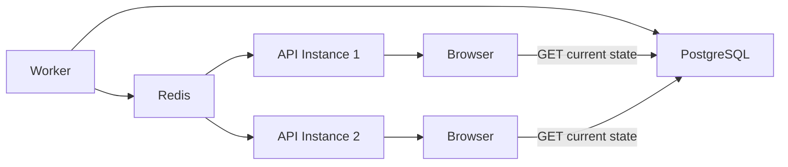

# URLPulse — Live Updates

**Version:** 1.0  
**Status:** Draft  
**Transport:** Server-Sent Events (SSE)

---

# 1. Purpose

URLPulse must update the batch detail page as individual URL checks finish without requiring a manual refresh.

The live-update system must remain correct when:

- The browser refreshes
- The SSE connection drops
- The API restarts
- More than one API instance is running
- Workers complete jobs concurrently

The backend database remains the source of truth.

---

# 2. Why SSE

SSE is selected because the communication pattern is primarily:

```text
Server → Browser
```

The client needs to receive notifications when persisted batch state changes.

SSE provides:

- Native browser support
- Simple HTTP-based transport
- Automatic event semantics
- One-way server-to-client streaming
- Less infrastructure complexity than WebSockets for this use case

The application does not require bidirectional real-time communication.

---

# 3. High-Level Flow



Redis acts as the cross-instance event distribution layer.

PostgreSQL remains authoritative.

---

# 4. Event Flow

When a URL completes:

```text
Worker
  ↓
Persist state transactionally
  ↓
Publish batch.updated
  ↓
API instances receive event
  ↓
Relevant SSE clients receive notification
  ↓
Client refetches batch
  ↓
UI renders authoritative state
```

The event is a notification, not the source of truth.

---

# 5. Event Payload

Keep events small.

Example:

```json
{
  "type": "batch.updated",
  "batchId": "batch-id",
  "version": 42
}
```

The client can then request:

```text
GET /batches/:batchId
```

This avoids putting the entire batch state into Redis messages or SSE payloads.

---

# 6. Why Not Put Full State in SSE?

Sending full state through every event creates additional complexity:

- Larger messages
- More synchronization assumptions
- More complicated reconnect behavior
- Higher risk of clients applying stale events

A small invalidation/update event combined with an authoritative GET is easier to reason about.

---

# 7. Event Ordering

The critical ordering is:

```text
DATABASE COMMIT
      ↓
EVENT PUBLISH
```

Never intentionally publish:

```text
EVENT
  ↓
DATABASE COMMIT
```

Otherwise a client may refetch state before the database transaction is committed.

---

# 8. Cross-Instance Correctness

Assume:

```text
API 1 → Client A
API 2 → Client B
```

A worker may publish an event independently of both API instances.

Redis distributes the notification:

```text
Worker
  ↓
Redis
  ├── API 1
  └── API 2
```

Each API instance forwards the event only to its locally connected clients.

This prevents dependence on process-local event emitters.

---

# 9. Why Process-Local EventEmitter Is Insufficient

This design is unsafe:

```text
Worker → API process memory → Browser
```

With multiple API instances:

```text
Worker → API 1 memory
                 ↓
             Client A

Client B connected to API 2
```

Client B would never receive the event.

Therefore a shared event transport is required.

---

# 10. Connection Lifecycle

Recommended browser lifecycle:

```text
GET batch state
      ↓
Open SSE connection
      ↓
Receive events
      ↓
Refetch state
      ↓
Update UI
```

The client should keep one relevant SSE connection per active batch page.

---

# 11. Initial State Race

A subtle race exists:

```text
GET batch state
        ↓
URL finishes
        ↓
event published
        ↓
SSE connection opens
```

The browser could miss the event.

This is acceptable only because the event is not the source of truth.

The connection setup must be followed by a reconciliation fetch:

```text
Open/reconnect SSE
        ↓
GET current batch state
```

Therefore a missed event cannot leave the page permanently stale.

---

# 12. Reconnection

When the connection closes:

```text
SSE disconnected
       ↓
show RECONNECTING
       ↓
wait with backoff
       ↓
reconnect
       ↓
refetch batch
       ↓
return LIVE
```

A small exponential reconnect delay prevents aggressive reconnect loops.

---

# 13. Refresh Safety

Browser refresh destroys all client state.

After refresh:

```text
GET /batches/:id
        ↓
render current persisted state
        ↓
connect SSE
```

No previous browser memory is required.

This directly satisfies the requirement that opening a batch URL cold must show the correct state.

---

# 14. Terminal Batches

If the batch is already:

```text
COMPLETED
FAILED
CANCELLED
```

the client does not need continuous live updates.

The page can:

```text
fetch state
→ render final state
```

and avoid maintaining an unnecessary SSE connection.

---

# 15. Active Batches

For:

```text
PENDING
PROCESSING
```

the page maintains the SSE connection.

When the batch reaches a terminal state:

```text
final event
↓
refetch
↓
render terminal state
↓
close SSE
```

---

# 16. Heartbeats

Long-lived HTTP connections may be terminated by proxies or load balancers if no data is transmitted.

The SSE endpoint should periodically send a lightweight heartbeat/comment.

Example:

```text
: heartbeat
```

This is not an application state event.

---

# 17. Client Event Handling

Conceptually:

```ts
const source = new EventSource(eventsUrl);

source.addEventListener("batch.updated", () => {
  queryClient.invalidateQueries({
    queryKey: ["batch", batchId],
  });
});
```

The exact query library is an implementation choice.

---

# 18. Duplicate Events

The same notification may be delivered more than once.

The client must tolerate:

```text
batch.updated
batch.updated
batch.updated
```

because refetching authoritative state is idempotent.

The UI should not increment counters based on event count.

---

# 19. Version Field

Events may contain a monotonically increasing batch version:

```text
version = 41
version = 42
version = 43
```

This can help diagnose or reject obviously stale events.

However, correctness must still come from PostgreSQL.

---

# 20. Event Delivery Semantics

The live-update path should be treated as:

```text
at-least-once notification
```

not exactly-once delivery.

The UI must therefore be safe with:

- Duplicate events
- Missing events
- Reordered events

because reconciliation fetches the current state.

---

# 21. API Scaling

With multiple API instances:

```text
                 ┌── API 1 ── Client A
Worker → Redis ──┼── API 2 ── Client B
                 └── API 3 ── Client C
```

All instances receive shared notifications.

No client depends on being connected to the same API process that handled a worker update.

---

# 22. Failure Modes

### Redis unavailable

Live event delivery may temporarily stop.

The UI can still recover through:

```text
manual refresh
```

or reconnect/fallback logic.

The database remains correct.

### API instance restart

Clients reconnect and refetch state.

### Worker restart

Persisted state remains in PostgreSQL and BullMQ.

### Browser network loss

SSE reconnects and reconciles state.

---

# 23. Correctness Principle

The most important rule is:

> SSE improves freshness; PostgreSQL guarantees correctness.

If SSE completely disappeared:

```text
GET /batches/:id
```

would still return the correct state.

---

# 24. Related Documents

```text
docs/03-backend/api.md
docs/03-backend/job-lifecycle.md
docs/03-backend/cancellation.md
docs/03-backend/retries-and-idempotency.md
docs/04-frontend/frontend-architecture.md
docs/05-infrastructure/scaling.md
```
