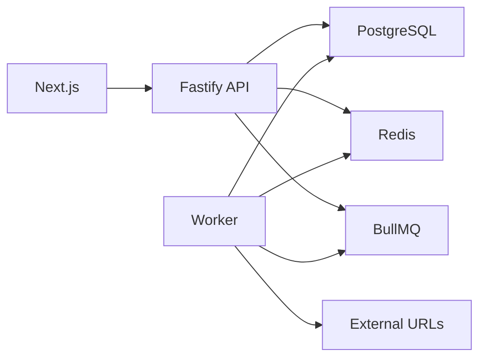

# URLPulse - Local Development

**Version:** 1.0  
**Status:** Draft

---

# 1. Purpose

The local development environment should run the complete URLPulse system with one documented command.

The development stack consists of:

```text
Next.js
Fastify API
Worker process
PostgreSQL
Redis
BullMQ
```

---

# 2. Recommended Runtime

Use Docker Compose for infrastructure:

```text
PostgreSQL
Redis
```

Run application processes through the repository's package scripts or development orchestrator.

A final implementation may also containerize the API, worker, and frontend if that makes the one-command workflow simpler.

---

# 3. Developer Experience (current scaffold)

Infrastructure runs in Docker; application processes run on the host via pnpm for
fast iteration:

```bash
pnpm install
cp .env.example .env
docker compose up -d      # PostgreSQL + Redis
pnpm db:migrate           # apply SQL migrations
pnpm dev                  # web + api + worker in parallel
```

Individual processes: `pnpm dev:web`, `pnpm dev:api`, `pnpm dev:worker`.

The `docker-compose.yml` intentionally provisions only PostgreSQL and Redis. The
web, API, and worker are not containerized for local development (see §18 and
ADR-029/ADR-030).

---

# 4. Services

Conceptual topology:



BullMQ uses Redis as its queue backend.

---

# 5. Environment Variables

Use environment variables for runtime configuration.

Example:

```text
DATABASE_URL=postgresql://...
REDIS_URL=redis://...
API_PORT=4000
NEXT_PUBLIC_API_URL=http://localhost:4000/api
```

Do not commit secrets.

Provide:

```text
.env.example
```

with safe placeholder values.

---

# 6. Database Initialization

Local startup should create the PostgreSQL database automatically.

Migrations should then create:

- Batches table
- URLs table
- Required enums/types
- Indexes
- Constraints

Schema changes must be represented as versioned migrations.

Avoid relying on manually executed SQL that is not checked into the repository.

---

# 7. Redis Initialization

Redis requires no application schema migration.

BullMQ creates and manages its queue data structures.

Development Redis data may be disposable.

---

# 8. API Startup

The API process is responsible for:

- HTTP routes
- Request validation
- Database access
- Queue creation
- SSE connections

It must not execute URL health checks itself.

---

# 9. Worker Startup

The worker process is separate from the API.

Conceptually:

```bash
pnpm worker
```

The worker:

- Connects to PostgreSQL
- Connects to Redis
- Consumes BullMQ jobs
- Performs URL checks
- Persists results
- Publishes live-update notifications

---

# 10. Frontend Startup

The Next.js application provides:

- Batch creation UI
- Batch list
- Batch detail
- Live progress
- Controls

It communicates with the Fastify API rather than directly accessing PostgreSQL or Redis.

---

# 11. One-Command Requirement

The final repository should make this possible:

```text
clone repository
      ↓
install dependencies
      ↓
configure environment
      ↓
run one documented command
      ↓
frontend + API + worker + infrastructure
```

If environment setup requires a separate command, document it explicitly as setup rather than hiding it.

---

# 12. Health Checks

Local infrastructure should expose useful health checks.

API:

```text
GET /health
```

Expected response:

```json
{
  "status": "ok"
}
```

A deeper readiness check may verify:

```text
PostgreSQL connectivity
Redis connectivity
```

---

# 13. Graceful Shutdown

API and worker processes should handle termination signals.

Worker shutdown should:

```text
stop accepting new jobs
↓
allow active work to finish where practical
↓
release resources
↓
close database connections
↓
close Redis connections
```

The API should close:

- HTTP server
- Database pool
- Redis connections
- SSE resources

---

# 14. Logging

Development logs should make process boundaries obvious.

Example:

```text
[api] listening on :4000
[worker] connected to queue
[worker] processing url ...
[worker] completed url ...
```

Use structured logs where practical.

---

# 15. Database Inspection

Developers should be able to inspect PostgreSQL during development.

Useful tools are optional, but the primary application should not depend on a GUI database tool.

---

# 16. Resetting Development Data

Provide a documented reset workflow.

Example:

```text
drop database
re-run migrations
```

or an equivalent script.

Do not make production data reset operations available through ordinary application endpoints.

---

# 17. Seed Data

Seed data is optional.

If provided, it should be deterministic and clearly separated from migrations.

Example:

```bash
pnpm db:seed
```

The application must work without seed data.

---

# 18. Docker Compose Responsibility

Docker Compose should primarily make infrastructure reproducible.

Expected infrastructure:

```text
postgres
redis
```

Application services may also be included if that provides the cleanest one-command experience.

---

# 19. Port Configuration

Avoid unnecessary hard-coded conflicts.

Example defaults:

```text
Next.js → 3000
Fastify → 4000
PostgreSQL → 5432
Redis → 6379
```

The actual ports can be overridden through environment configuration.

---

# 20. Local vs Production

Local development should not pretend to be production.

Examples:

```text
local:
single PostgreSQL
single Redis
single worker

production:
multiple workers
multiple API instances
managed infrastructure
```

The architecture must nevertheless preserve the distributed correctness guarantees when scaled.

---

# 21. Troubleshooting

README should include common failures:

### PostgreSQL connection refused

Check:

```text
database container
DATABASE_URL
```

### Redis connection refused

Check:

```text
redis container
REDIS_URL
```

### Worker receives no jobs

Check:

```text
worker process
queue name
Redis connection
```

### UI does not update

Check:

```text
API
SSE connection
Redis pub/sub
```

---

# 22. Related Documents

```text
README.md
docs/02-architecture/architecture.md
docs/03-backend/api.md
docs/05-infrastructure/scaling.md
docs/06-quality/testing.md
```
